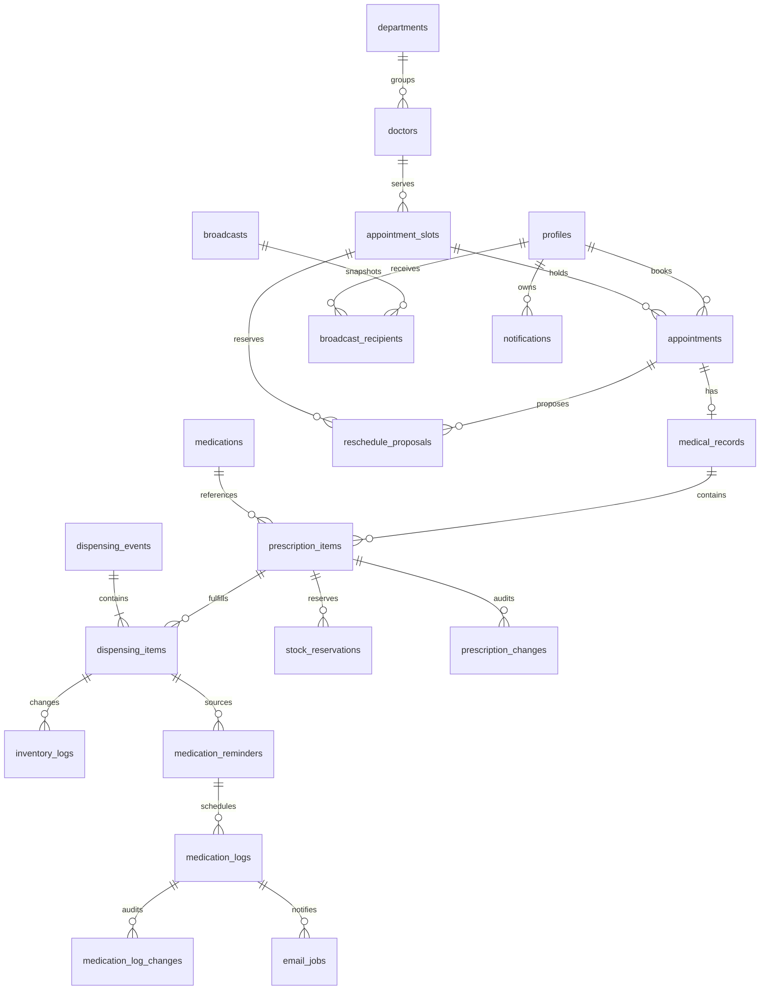

# 03. แบบข้อมูลและ ER

ปรับปรุง 6 กันยายน 2569 (2026-09-06) — ทีมรับรองแบบแยกตารางแล้ว การมี migration ยังไม่ใช่หลักฐานว่าฐานจริงถูกอัปเกรดหรือผ่านการตรวจรับ

## สถานะ

ทีมรับรองแบบแยกตารางตามเอกสารออกแบบวันที่ 6 กันยายน 2569 แล้ว ฐานเดิม 11 ตารางยังคงอยู่เพื่อ compatibility และเพิ่มตารางธุรกรรมด้วย `supabase/migrations/03_normalized_transactions.sql` โดยไม่ backfill JSONB เพราะฐานปัจจุบันมีแต่ข้อมูลทดลอง

## ข้อมูลฐานเดิมและส่วนที่ต้องปรับ

| Entity | ข้อมูลหลัก/ความสัมพันธ์ | ผลจากข้อสรุป |
| --- | --- | --- |
| profiles | id → auth.users; full_name, phone, role, student_id, allergies, chronic_diseases | เพิ่มประเภทผู้ป่วย รหัสบุคลากร หน่วยงาน มี/ไม่มี/ไม่ทราบ และสถานะบัญชี/รุ่นสิทธิ์; จำกัดข้อมูลอ่านตามบทบาท |
| departments | id, name, description | คง 4 แผนกตาม Catalog; ปิดใช้งานโดยรักษาประวัติ |
| doctors | id → profiles, department_id → departments, specialty | สังกัดหนึ่งแผนกตามฐานเดิม |
| appointment_slots | doctor_id, slot_date, start_time, end_time, max_capacity, booked_count, status | available/full/closed; วันไทย ไม่มีข้ามวัน; คิดความจุรวมที่กันไว้ |
| appointments | user_id → profiles, slot_id, queue_number, reason, status | pending/confirmed/in_progress/completed/cancelled/no_show/rejected; ต้องเชื่อมประวัติข้อเสนอเลื่อนนัด |
| medical_records | appointment_id, patient_id, doctor_id, diagnosis, treatment, prescribed_medications | หนึ่งนัดต่อผลตรวจ; JSONB เดิมไม่พออธิบายประวัติแบ่งจ่ายด้วยสถานะทั้งใบเพียงค่าเดียว |
| medications | id, name, type, category, stock, min_stock, expiry_date, is_active | แยกยอดคงคลังกับยอดพร้อมจ่ายหลังหักการกัน |
| inventory_logs | medication_id, quantity_change, transaction_type, performed_by, timestamp | ผูกการจ่ายจริงแต่ละครั้งและเหตุผล ไม่ลงการกันเป็นการจ่าย |
| medication_reminders | user_id, medication_id, times, start/end | ผูกยาที่จ่ายจริง ผู้สร้าง Staff ผู้ยืนยันและเวลายืนยัน; ล็อกหลังยืนยัน |
| medication_logs | reminder_id, scheduled_time, actual_time, status | pending/taken/missed; เส้นตายบันทึกและประวัติแก้ ไม่ใช้ skipped แทน missed |
| notifications | user_id, type, title, message, is_read, created_at | เจ้าของกล่องเท่านั้น; ผูกเหตุการณ์เพื่อกันซ้ำและแยกประวัติ Broadcast กลาง |

ชื่อ field/status ที่รับรองอยู่ใน migration 03 และ `src/types/database.ts`; ตารางสรุปนี้ใช้อธิบายหน้าที่

## ER ข้อมูลธุรกรรมที่รับรอง

## Data Dictionary ส่วนที่รับรองเพิ่ม

| Entity เสนอ | ข้อมูลที่ต้องเก็บ |
| --- | --- |
| reschedule_proposals | appointment, old/new slot, ผู้เสนอ, sent_at, response_deadline = sent_at + 24h, ผลตอบ/ยืนยันอัตโนมัติ, เวลาสิ้นสุดการกัน, version |
| prescription_items | medical_record, medication, จำนวนสั่ง/หน่วย/คำสั่งใช้, version; จำนวนจ่ายแล้ว ค้าง ยกเลิกค้างคำนวณจากประวัติ |
| dispensing_events / dispensing_items | รหัสการจ่ายแต่ละครั้ง ผู้จ่าย เวลา รายการยา จำนวนจริง เหตุผลแบ่งจ่าย และ idempotency key |
| stock_reservations | รายการยา จำนวนกัน ผู้ยืนยันพร้อมจ่าย เวลา สถานะกัน/ใช้/ปล่อยและเหตุผล |
| prescription_changes | รายการ/เวอร์ชัน ก่อน–หลัง เหตุผล ผู้แก้ เวลา ไม่แก้ทับส่วนที่จ่ายแล้ว |
| medication_log_changes | มื้อ ก่อน–หลัง actual_time ผู้แก้ เวลา เหตุผล/ชนิดการแก้ |
| email_jobs | เหตุการณ์/มื้อ ผู้รับ scheduled_at ชนิดปกติ/ซ้ำ/เจ้าหน้าที่ สถานะ attempt ผู้ให้บริการและข้อผิดพลาด |
| broadcasts / broadcast_recipients | ผู้ส่ง เนื้อหา request key; รายชื่อผู้รับตรึงด้วย broadcast_id + user_id และสถานะกล่องของผู้รับ |

ข้อมูลพักอีเมลต้องมี pause_until; การส่งโดย Staff ต้องบันทึกผู้ส่ง เหตุผล และข้อจำกัด 1 ครั้งต่อมื้อทั้งระบบ จะเก็บในตารางใดให้รับรองพร้อมแบบสุดท้าย

## Invariants ที่แบบสุดท้ายต้องรองรับ

- 0 ≤ จำนวนจอง/กันที่ ≤ ความจุ; การกดซ้ำไม่เพิ่มหรือลดความจุซ้ำ รอบ closed ไม่เปิดเองเมื่อคืนที่
- จำนวนค้าง = จำนวนสั่ง − จ่ายแล้ว − ยกเลิกค้าง โดยทุกส่วนไม่ติดลบ การแก้ใบสั่งสร้างประวัติ/เวอร์ชันและคงการจ่ายเดิม
- ยอดพร้อมจ่าย = stock − จำนวนกันที่ยังมีผล; การจ่าย การกันและการปล่อยทำภายในธุรกรรม ตรวจ version และสิทธิ์ซ้ำ
- ห้ามจ่ายเกินค้างหรือใช้ยาที่กันให้คนอื่น; การกดคำขอเดิมซ้ำไม่ตัดสต๊อกซ้ำ แต่การรับยาค้างครั้งใหม่ทำได้
- หนึ่งมื้อต่อรายการเตือนและเวลาที่กำหนด; หนึ่งผู้รับต่อ Broadcast; งานส่งแต่ละชนิดต้องมีรหัสกันซ้ำ
- แยกผลวินิจฉัยจากข้อมูลจ่ายยาให้ Staff/Pharmacist อ่านเฉพาะช่องที่อนุญาต RLS รายแถวอย่างเดียวไม่จำกัดคอลัมน์ในแถว
- ข้อมูลเวลาเหตุการณ์ใช้ timestamp ที่ระบุเขตเวลา ส่วนแสดงวัน/เส้นตายใช้ Asia/Bangkok

## แผน migration

เพิ่ม migration 03 แบบ additive และ types แล้ว โดยไม่แก้ migration เดิม ไม่ backfill JSONB และไม่รันกับฐานจริง ขั้นต่อไปคือตรวจ RLS/views/RPC, ทดสอบติดตั้งใหม่ และให้หัวหน้าทีมรันกับฐานทดลองเมื่ออนุมัติ ดู [09](09_implementation_plan.md)

## Data Dictionary ของฐานเดิม

ส่วนนี้คืนรายละเอียดโครงสร้าง 11 ตารางที่มีอยู่ใน `supabase/migrations/01_schema.sql` เพื่อให้ทีมอ่าน contract เดิมได้ครบ ไม่ได้ยืนยันว่า field เหล่านี้เพียงพอสำหรับข้อสรุปล่าสุด

### `profiles`

- `id` UUID, PK และ FK ไป `auth.users.id`
- `student_id` text unique, `full_name` text, `phone`, `emergency_phone`, `address`, `avatar_url`
- `allergies`, `chronic_diseases` เป็นข้อความเดิม; แบบใหม่ต้องแยกคำตอบ มี/ไม่มี/ไม่ทราบ ออกจากรายละเอียด
- `role` เป็นหนึ่งใน `patient`, `staff`, `doctor`, `pharmacist`, `admin`; มี `created_at`, `updated_at`
- ต้องเพิ่มแบบที่รับรองภายหลังสำหรับประเภทผู้ป่วย, รหัสบุคลากร, หน่วยงาน, สถานะบัญชี และกลไกยกเลิกสิทธิ์ session เดิม

### `departments` และ `doctors`

- `departments`: `id`, `name`, `description`, `created_at`, `updated_at`
- `doctors`: `id` เป็น PK/FK ไป `profiles`, `specialty`, `department_id` ไป `departments`, timestamps
- ข้อกำหนดล่าสุดให้ปิดใช้งานรายการที่มีประวัติแทนลบ และแพทย์หนึ่งคนสังกัดหนึ่งแผนกในรุ่นแรก

### `appointment_slots` และ `appointments`

- `appointment_slots`: `id`, `doctor_id`, `slot_date`, `start_time`, `end_time`, `max_capacity`, `booked_count`, `status`, timestamps
- สถานะรอบเดิมคือ `available`, `full`, `closed`; ต้องบังคับ `start_time < end_time`, ความจุเป็นบวก และเวลาไทย
- `appointments`: `id`, `user_id`, `slot_id`, `queue_number`, `reason`, `status`, timestamps
- สถานะนัดคือ `pending`, `confirmed`, `in_progress`, `completed`, `cancelled`, `no_show`, `rejected`; ข้อเสนอเลื่อนนัดและการกันรอบใหม่เก็บใน `reschedule_proposals`

### `medical_records`

- `id`, `appointment_id`, `patient_id`, `doctor_id`, `diagnosis`, `treatment_notes`, `prescribed_medications`, timestamps
- `prescribed_medications` เดิมเป็น JSONB ที่เก็บ `medication_id`, ชื่อยา, ขนาด, ความถี่, จำนวนวัน และจำนวนที่สั่ง
- JSONB เดิมยังใช้เป็นข้อมูลอ้างอิงได้ แต่ต้องไม่ใช้เป็นหลักฐานว่าเก็บจ่ายบางส่วน, การกันยา และประวัติแก้ไขได้ครบ

### `medications` และ `inventory_logs`

- `medications`: `id`, `name`, `type`, `category`, `stock`, `min_stock`, `expiry_date`, `description`, `ingredients`, `is_active`, timestamps
- `inventory_logs`: `id`, `medication_id`, `pharmacist_id`, `action`, `quantity`, `reason`, `created_at`
- action เดิมคือ `add`, `dispense`, `adjust`, `damage`; แบบใหม่ต้องเชื่อม log กับรายการจ่ายจริงและไม่ลงการกันยาเป็นการตัดสต๊อก

### `medication_reminders` และ `medication_logs`

- `medication_reminders`: `id`, `user_id`, `medication_id`, `reminder_times`, `start_date`, `end_date`, `status`, timestamps
- `medication_logs`: `id`, `reminder_id`, `scheduled_datetime`, `actual_datetime`, `status`, timestamps
- สถานะมื้อคือ `pending`, `taken`, `missed`; แบบใหม่ต้องเพิ่มผู้สร้าง, การยืนยัน/ล็อกเวลา, deadline และประวัติแก้ โดย Staff สร้างจากยาที่จ่ายจริง

### `notifications`

- `id`, `user_id`, `type`, `title`, `message`, `is_read`, `created_at`
- type เดิมคือ `reminder`, `appointment`, `broadcast`, `system`
- แบบใหม่ต้องมีตัวระบุกันซ้ำ, แยก Broadcast กลางจากกล่องรายคน, และเก็บผลงานส่งอีเมล/การพักโดยไม่กล่าวอ้างว่าตารางเดิมรองรับครบ
