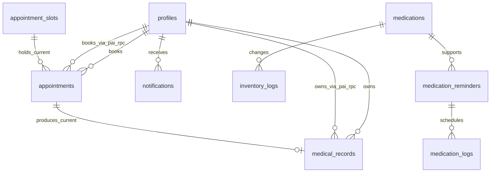

# 03. แบบข้อมูลและ ER

ปรับปรุง 23 กันยายน 2569 (2026-09-23) — แยก ER ของ Scheduling ไปยัง owner docs; ไฟล์นี้คงแผนที่ข้อมูลร่วมและการเชื่อมต่อข้ามโมดูล พร้อมแยกหลักฐาน DB/RLS

> ไฟล์ schema snapshot จาก Supabase เป็นข้อมูลอ้างอิง ไม่ควรรันตรง ๆ เพราะไม่มีลำดับ Foreign Key ที่รับประกันได้ ให้ใช้ migration ตามลำดับ รวม `supabase/migrations/13_services_and_daily_offerings.sql` สำหรับฐานที่มี schema เดิมแล้ว

> **หลักฐาน environment:** [Database_check.md](Database_check.md) เป็น DB snapshot ที่ผู้ใช้ยืนยันว่าเป็น target ปัจจุบันเดียวกับ runtime. Snapshot พบ `appointments`/`medical_records` และ RPC `pai_*` แต่ไม่พบ `pai_appointments`, `pai_medical_records` และ `broadcast_recipients`; migration ที่เกี่ยวข้องได้รับการยืนยันว่า deploy แล้ว และ `21`/`28` ชี้ RPC ชื่อ PAI ไปยังตาราง canonical ปัจจุบัน. ยังไม่ถือว่า session-based RLS ผ่าน

## สถานะและขอบเขต

- Runtime ใช้ Supabase ผ่าน database repository/API; mock repository ใช้เฉพาะ automated tests ไม่มี offline demo หรือ mock fallback ในแอป
- Base schema เดิมมี 11 ตาราง; migration เพิ่ม `services`, `daily_service_offerings`, `broadcasts` และเคยเสนอ `pai_appointments`/`pai_medical_records` ใน migration รุ่นแรก จึงไม่ควรสรุปจำนวนตารางเดียวโดยไม่ระบุ migration target
- Active appointment/record runtime ใน code และ migration รุ่นหลังใช้ `appointments` และ `medical_records` ผ่าน RPC ชื่อ `pai_*`; `pai_appointments` และ `pai_medical_records` เป็น target จาก migration รุ่นแรกที่ snapshot นี้ไม่พบ
- บทบาทใน `profiles.role` เหลือ 3 ค่าเท่านั้น: `patient`, `medical`, `staff_admin`
- `medical` ครอบคลุมแพทย์และเภสัชกร; `staff_admin` ครอบคลุมเจ้าหน้าที่และแอดมิน
- ตาราง normalized รุ่นเก่า เช่น `reschedule_proposals`, `prescription_items`, `dispensing_items`, `stock_reservations` และ `email_jobs` ไม่อยู่ใน scope ปัจจุบัน; `broadcasts` ใน migration `03_normalized_transactions.sql` เป็นของเก่า แต่ migration `09_broadcast_rpc.sql` มี Broadcast path แยกที่ต้องตรวจ target จริง
- คอลัมน์ compatibility ที่ยังอยู่ใน base/legacy tables ไม่ใช่หลักฐานว่าเปิดใช้ workflow เก่าแล้ว

## แผนที่ข้อมูลจาก code path ปัจจุบัน

| เส้นทาง | ตาราง/ฟังก์ชันหลัก | ข้อสรุปจาก repository |
| --- | --- | --- |
| Scheduling | [Owner view ของสุพจน์](owners/shop-supot/README.md) | รายละเอียดตารางและ as-built trace แยกอยู่ใน owner docs |
| Appointment | `appointments`, `pai_workspace`, `pai_book_appointment`, `pai_transition_appointment` | route `/appointments` ใช้ RPC ชื่อ PAI แต่ migration รุ่นปัจจุบันชี้ไป `appointments`; ไม่ใช่หลักฐานว่า RPC deploy บน target แล้ว |
| Medical record | `medical_records`, `pai_save_record` | route `/records` ใช้ RPC ชื่อ PAI ที่ migration `28` ชี้ไป `medical_records`; หนึ่งผลตรวจต่อนัดตาม schema/test ที่พบ |
| Pharmacy | `medications`, `inventory_logs`, `medicationService`, `/pharmacy` | ใช้ medication API; ยังไม่ยืนยัน integration จ่ายยากับนัดแบบครบวงจรหรือ atomicity |
| Reminder/notification | `medication_reminders`, `medication_logs`, `notifications` และ service ที่เกี่ยวข้อง | ใช้ reminder API และ Supabase service; ไม่มี mock data fallback |
| Broadcast | `broadcasts`/RPC และ `notifications` | มี migration/RPC แยก; ต้องตรวจว่าฐานเป้าหมาย apply แล้ว |

ตารางนี้คือ as-built map ไม่ใช่การเปลี่ยน target requirement ใน [08](08_system_rules_and_acceptance.md), [09](09_implementation_plan.md) หรือ [10](10_team_decisions.md)

## RLS สำหรับค้นหาผู้ป่วย

ผู้ใช้ role `medical` และ `staff_admin` อ่านข้อมูลใน `profiles` ของผู้ป่วยได้ เพื่อใช้หน้าค้นหาผู้ป่วย ส่วนผู้ใช้ role `patient` อ่านได้เฉพาะ profile ของตนเองตาม policy เดิม การแก้ policy สำหรับฐานเดิมอยู่ใน `supabase/migrations/08_allow_medical_patient_search.sql`:

```sql
DROP POLICY IF EXISTS "Staff/Admin can view all profiles" ON public.profiles;
DROP POLICY IF EXISTS "Staff admin and medical can view profiles" ON public.profiles;

CREATE POLICY "Staff admin and medical can view profiles"
  ON public.profiles FOR SELECT
  USING (public.get_user_role() IN ('staff_admin', 'medical'));
```

ต้องรัน migration นี้บนฐาน development/staging หรือฐาน runtime ที่ตรวจสอบ target แล้วก่อนอ้างว่าการค้นหาผู้ป่วยผ่าน RLS ทำงานจริง เอกสารและ migration ใน repository ยังไม่ใช่หลักฐานว่า deploy แล้ว

## Role contract

| ลำดับ | บทบาท | ค่าใน `profiles.role` | ขอบเขตหลัก |
| --- | --- | --- | --- |
| 1 | ผู้ป่วย | `patient` | โปรไฟล์ นัด รายการเตือน และข้อมูลของตน |
| 2 | แพทย์/เภสัชกร | `medical` | ตรวจรักษา บันทึกผล และจัดการยาตามหน้าที่ |
| 3 | เจ้าหน้าที่/แอดมิน | `staff_admin` | จัดการบัญชี แผนก บริการ daily offering slot นัดหมาย รายการเตือน Dashboard และ Broadcast |

นักศึกษา/บุคลากรเป็น `patient_type` ไม่ใช่ role เพิ่ม และผู้ใช้หนึ่งบัญชีมี role เดียว

## ตารางใน scope ปัจจุบัน

| ตาราง | หน้าที่และความสัมพันธ์ | ข้อจำกัดหลัก |
| --- | --- | --- |
| `profiles` | บัญชีผู้ใช้ ขยายจาก `auth.users` | role ต้องเป็น 3 ค่า canonical |
| Scheduling module | แผนก แพทย์ บริการ วันลา offering และ slot | รายการ entity, key และความสัมพันธ์อยู่ใน [ER ของสุพจน์](owners/shop-supot/er.md) |
| `pai_appointments` | target จาก migration PAI รุ่นแรก | ไม่พบใน `Database_check.md`; ห้ามถือเป็น active table จนกว่าจะยืนยัน migration target |
| `pai_medical_records` | target จาก migration PAI รุ่นแรก | ไม่พบใน `Database_check.md`; ห้ามถือเป็น active table จนกว่าจะยืนยัน migration target |
| `appointments` | ตารางนัด canonical ที่ migration `21` ให้ PAI RPC ใช้งาน | active code path ผ่าน RPC; ไม่มี auto-reschedule/auto-no-show |
| `medical_records` | ตารางผลตรวจ canonical ที่ migration `28` ให้ PAI RPC ใช้งาน | ผูกกับ `appointments`; `appointment_id` unique ตาม migration/test; รายการยาเป็น JSONB |
| `medications` | Catalog และยอดคลังยา | ยอด stock ใช้ประกอบการจ่ายยา |
| `inventory_logs` | ประวัติรับเข้า ปรับยอด และจ่ายยา | เก็บผู้ทำรายการและจำนวน |
| `medication_reminders` | รายการเตือนยาของผู้ป่วย | ไม่มี worker หรือ email อัตโนมัติ |
| `medication_logs` | ผลการบันทึกกินยาแต่ละรายการ | ผู้ป่วยกดบันทึกเอง ไม่เปลี่ยนตามเวลา |
| `notifications` | กล่องข้อความรายผู้ใช้ | ผู้รับเป็นเจ้าของข้อมูลของตน |
| `broadcasts` | ประวัติคำสั่ง Broadcast ของ migration/RPC ปัจจุบัน | recipient ถูกสร้างเป็น `notifications` ที่มี `broadcast_id`; migration `05` ตั้งใจไม่ใช้ `broadcast_recipients`; ผู้ใช้ยืนยันให้ใช้ design นี้ต่อไป |

ข้อมูลตัวอย่างล่าสุดที่ส่งมามี 4 แผนกใน `departments` และ 8 รายการยาใน `medications`; การปรับ schema ไม่ลบหรือเปลี่ยนข้อมูลสองตารางนี้

## ER ปัจจุบัน



แผนภาพกลางแสดง `appointment_slots` เฉพาะจุดเชื่อมกับนัด; รายละเอียด schema Scheduling อยู่ใน owner ER. สัญลักษณ์ใน ER เป็นความสัมพันธ์เชิงแบบจำลอง ไม่ได้สั่งให้ระบบสร้างข้อมูลอัตโนมัติ เช่น snapshot ไม่ได้ประกาศ UNIQUE ของ `medical_records.appointment_id`

## Data dictionary ฉบับตรงกับ schema ล่าสุด

ชนิดข้อมูล, ค่า NULL, default และ FK ด้านล่างยึดตาม schema หลัง migration `33_remove_full_name.sql`. ชื่อที่แสดงผลประกอบจาก `title`, `first_name` และ `last_name` ที่ขอบเขตแอป/RPC ไม่ได้เก็บซ้ำเป็นคอลัมน์เดียว

### 1. `profiles`

| ฟิลด์ | Type | NULL | Default | Key / constraint | ความหมาย |
| --- | --- | --- | --- | --- | --- |
| `id` | `uuid` | ไม่ได้ | — | PK; FK → `auth.users.id` | รหัสบัญชีเดียวกับ Supabase Auth |
| `student_id` | `text` | ได้ | — | UNIQUE | รหัสนักศึกษา |
| `title` | `text` | ได้ | — | CHECK: `นาย`, `นาง`, `นางสาว`, `อื่น ๆ` | คำนำหน้า |
| `first_name` | `text` | ไม่ได้ | — | CHECK รูปแบบชื่อ | ชื่อจริง |
| `last_name` | `text` | ไม่ได้ | — | CHECK รูปแบบนามสกุล | นามสกุล |
| `date_of_birth` | `date` | ได้ | — | ไม่เกินวันปัจจุบัน | วันเดือนปีเกิด |
| `gender` | `text` | ได้ | — | CHECK: `male`, `female`, `unspecified` | เพศ |
| `phone` | `text` | ได้ | — | — | เบอร์โทรศัพท์ |
| `emergency_phone` | `text` | ได้ | — | — | เบอร์ติดต่อฉุกเฉิน |
| `address` | `text` | ได้ | — | — | ที่อยู่ |
| `allergies` | `text` | ได้ | — | — | รายละเอียดประวัติแพ้ยา |
| `chronic_diseases` | `text` | ได้ | — | — | รายละเอียดโรคประจำตัว |
| `role` | `text` | ไม่ได้ | `patient` | CHECK: `patient`, `medical`, `staff_admin` | role หลักของบัญชี |
| `avatar_url` | `text` | ได้ | — | — | URL รูปโปรไฟล์ |
| `created_at` | `timestamptz` | ไม่ได้ | `now()` | — | เวลาสร้างบัญชี |
| `updated_at` | `timestamptz` | ไม่ได้ | `now()` | — | เวลาปรับปรุงล่าสุด |
| `patient_type` | `text` | ได้ | — | CHECK: `student`, `employee` | ประเภทผู้ป่วย ไม่ใช่ role |
| `employee_id` | `text` | ได้ | — | — | รหัสบุคลากร |
| `organization` | `text` | ได้ | — | — | หน่วยงานของบุคลากร |
| `allergy_status` | `text` | ได้ | — | CHECK: `yes`, `no`, `unknown` | สถานะสรุปเรื่องแพ้ยา |
| `chronic_disease_status` | `text` | ได้ | — | CHECK: `yes`, `no`, `unknown` | สถานะสรุปโรคประจำตัว |
| `is_active` | `boolean` | ไม่ได้ | `true` | — | สถานะบัญชีใช้งาน |
| `permission_version` | `integer` | ไม่ได้ | `1` | CHECK: `> 0` | รุ่นสิทธิ์สำหรับทำให้ session เดิมหมดสิทธิ์ |

### Scheduling entities — owner model

Column definitions, keys, composite foreign keys and leave constraints for `departments`, `doctors`, `services`, `daily_service_offerings`, `appointment_slots` and `doctor_leaves` are maintained in [ER ของสุพจน์](owners/shop-supot/er.md). Domain rules and active code paths are in [User Stories](owners/shop-supot/user-stories.md) and [Use Cases](owners/shop-supot/use-cases.md).
### 4D. `pai_appointments` (historical initial PAI target)

> ตารางนี้มาจาก migration PAI รุ่นแรก (`13_pai_manual_appointments_records.sql`) แต่ไม่พบใน [Database_check.md](Database_check.md). Current PAI RPCs ถูกชี้ไปยัง `appointments` โดย migration `21`; ส่วนนี้คงไว้เพื่อ trace ไม่ใช่การยืนยัน active schema

| ฟิลด์ | Type | NULL | Default | Key / constraint | ความหมาย |
| --- | --- | --- | --- | --- | --- |
| `id` | `uuid` | ไม่ได้ | `gen_random_uuid()` | PK | รหัสนัด active |
| `patient_id` | `uuid` | ไม่ได้ | — | FK → `profiles.id` | ผู้ป่วยเจ้าของนัด |
| `slot_id` | `uuid` | ไม่ได้ | — | FK → `appointment_slots.id` | slot ที่เลือก |
| `queue_number` | `integer` | ไม่ได้ | — | CHECK: `> 0` | เลขคิวใน slot |
| `reason` | `text` | ไม่ได้ | — | CHECK: 1–2000 ตัวอักษร | อาการหรือเหตุผลที่ผู้ป่วยกรอก |
| `status` | `text` | ไม่ได้ | `pending` | CHECK: `pending`, `confirmed`, `in_progress`, `completed`, `cancelled`, `rejected`, `no_show` | สถานะที่ RPC อนุญาต |
| `cancel_requested_at` | `timestamptz` | ได้ | — | — | เวลาที่ผู้ป่วยส่งคำขอยกเลิก |
| `rejection_reason` | `text` | ได้ | — | CHECK: ถ้ามีต้อง 1–2000 ตัวอักษร | เหตุผลที่ staff ปฏิเสธ |
| `created_at`, `updated_at` | `timestamptz` | ไม่ได้ | `now()` | — | เวลาสร้าง/แก้ไข |

มี partial unique index ตาม migration รุ่นแรกเพื่อป้องกันการจอง active ซ้ำของผู้ป่วยใน slot เดียว; ไม่ใช้สรุปเป็น current remote schema จากเอกสารนี้

### 4E. `pai_medical_records` (historical initial PAI target)

> ตารางนี้มาจาก migration PAI รุ่นแรก (`13_pai_manual_appointments_records.sql`) แต่ไม่พบใน [Database_check.md](Database_check.md). Current `pai_save_record` ใน migration `28` ใช้ `medical_records`; ส่วนนี้คงไว้เพื่อ trace ไม่ใช่การยืนยัน active schema

| ฟิลด์ | Type | NULL | Default | Key / constraint | ความหมาย |
| --- | --- | --- | --- | --- | --- |
| `id` | `uuid` | ไม่ได้ | `gen_random_uuid()` | PK | รหัสผลตรวจ active |
| `appointment_id` | `uuid` | ไม่ได้ | — | UNIQUE; FK → `pai_appointments.id` | นัดต้นทาง; หนึ่งผลตรวจต่อนัด |
| `patient_id` | `uuid` | ไม่ได้ | — | FK → `profiles.id` | ผู้ป่วยเจ้าของผลตรวจ |
| `doctor_id` | `uuid` | ไม่ได้ | — | FK → `doctors.id` | แพทย์เจ้าของนัด |
| `diagnosis` | `text` | ไม่ได้ | — | CHECK: 1–5000 ตัวอักษร | ผลวินิจฉัย |
| `treatment_notes` | `text` | ไม่ได้ | `''` | CHECK: ไม่เกิน 5000 ตัวอักษร | คำแนะนำ/บันทึกการรักษา |
| `prescribed_medications` | `jsonb` | ไม่ได้ | `[]` | CHECK: JSON array | รายการยาที่สั่ง; RPC ตรวจยา active, จำนวน, วิธีใช้ และรายการซ้ำ |
| `created_at` | `timestamptz` | ไม่ได้ | `now()` | — | เวลาสร้างผลตรวจ |

กติกาเดียวกันถูกนำไปใช้กับ `medical_records` ผ่าน `pai_save_record` ใน migration `28`; ตารางนี้ยังไม่ใช่ dispense/inventory transaction

### 5. `appointments` (current PAI RPC target)

| ฟิลด์ | Type | NULL | Default | Key / constraint | ความหมาย |
| --- | --- | --- | --- | --- | --- |
| `id` | `uuid` | ไม่ได้ | `gen_random_uuid()` | PK | รหัสนัด |
| `patient_id` | `uuid` | ไม่ได้ | — | FK → `profiles.id` | ผู้ป่วยเจ้าของนัด; domain rule ต้องเป็น `patient` |
| `slot_id` | `uuid` | ไม่ได้ | — | FK → `appointment_slots.id` | slot ที่เลือก |
| `queue_number` | `integer` | ได้ | — | — | เลขคิวใน slot |
| `reason` | `text` | ได้ | — | — | เหตุผลหรืออาการ |
| `status` | `text` | ไม่ได้ | `pending` | CHECK: `pending`, `confirmed`, `in_progress`, `completed`, `cancelled`, `no_show`, `rejected` | สถานะนัด; ไม่มีการเปลี่ยนตามเวลาอัตโนมัติ |
| `created_at` | `timestamptz` | ไม่ได้ | `now()` | — | เวลาสร้างนัด |
| `updated_at` | `timestamptz` | ไม่ได้ | `now()` | — | เวลาปรับปรุงล่าสุด |

`no_show` คงไว้ตาม schema ล่าสุดเพื่อรองรับข้อมูลเดิม แต่ไม่มี auto-no-show ใน scope manual

### 6. `medical_records` (current PAI RPC target)

| ฟิลด์ | Type | NULL | Default | Key / constraint | ความหมาย |
| --- | --- | --- | --- | --- | --- |
| `id` | `uuid` | ไม่ได้ | `gen_random_uuid()` | PK | รหัสผลตรวจ |
| `appointment_id` | `uuid` | ไม่ได้ | — | FK → `appointments.id` | นัดต้นทาง |
| `patient_id` | `uuid` | ไม่ได้ | — | FK → `profiles.id` | ผู้ป่วยเจ้าของผลตรวจ |
| `doctor_id` | `uuid` | ไม่ได้ | — | FK → `doctors.id` | แพทย์ผู้รับผิดชอบ |
| `diagnosis` | `text` | ได้ | — | — | ผลวินิจฉัย |
| `treatment_notes` | `text` | ได้ | — | — | คำแนะนำ/บันทึกการรักษา |
| `prescribed_medications` | `jsonb` | ได้ | — | JSON shape: `PrescribedMedication[]` | รายการยาในผลตรวจ |
| `created_at` | `timestamptz` | ไม่ได้ | `now()` | — | เวลาสร้างผลตรวจ |
| `updated_at` | `timestamptz` | ไม่ได้ | `now()` | — | เวลาปรับปรุงล่าสุด |

รายการยาใน JSONB ควรมี `medication_id`, `name`, `dosage`, `frequency`, `duration_days`, `quantity`; ไม่แยกเป็นตาราง prescription ใน scope ปัจจุบัน

### 7. `medications`

| ฟิลด์ | Type | NULL | Default | Key / constraint | ความหมาย |
| --- | --- | --- | --- | --- | --- |
| `id` | `uuid` | ไม่ได้ | `gen_random_uuid()` | PK | รหัสยา |
| `name` | `text` | ไม่ได้ | — | — | ชื่อยาและขนาด |
| `type` | `text` | ไม่ได้ | — | — | รูปแบบยา เช่น เม็ด/แคปซูล/ผง/เจล |
| `category` | `text` | ไม่ได้ | — | — | หมวดหมู่ยา |
| `stock` | `integer` | ไม่ได้ | `0` | — | จำนวนคงเหลือ |
| `min_stock` | `integer` | ไม่ได้ | `0` | — | ระดับ stock ขั้นต่ำ |
| `expiry_date` | `date` | ได้ | — | — | วันหมดอายุ |
| `description` | `text` | ได้ | — | — | รายละเอียดการใช้ |
| `ingredients` | `text` | ได้ | — | — | ส่วนประกอบ/สารสำคัญ |
| `created_at` | `timestamptz` | ไม่ได้ | `now()` | — | เวลาสร้างรายการ |
| `updated_at` | `timestamptz` | ไม่ได้ | `now()` | — | เวลาปรับปรุงล่าสุด |
| `is_active` | `boolean` | ได้ | `true` | — | เปิด/ปิดรายการใน Catalog; snapshot อนุญาต NULL |

### 8. `inventory_logs`

| ฟิลด์ | Type | NULL | Default | Key / constraint | ความหมาย |
| --- | --- | --- | --- | --- | --- |
| `id` | `uuid` | ไม่ได้ | `gen_random_uuid()` | PK | รหัสประวัติคลัง |
| `medication_id` | `uuid` | ไม่ได้ | — | FK → `medications.id` | ยาที่เปลี่ยนยอด |
| `pharmacist_id` | `uuid` | ไม่ได้ | — | FK → `profiles.id` | ผู้ทำงานยาใน role `medical` |
| `action` | `text` | ไม่ได้ | — | domain: `add`, `dispense`, `adjust`, `damage` | ประเภทการเปลี่ยนคลัง |
| `quantity` | `integer` | ไม่ได้ | — | — | จำนวนที่รับเข้า/จ่าย/ปรับ/เสียหาย |
| `reason` | `text` | ได้ | — | — | เหตุผลของรายการ |
| `created_at` | `timestamptz` | ไม่ได้ | `now()` | — | เวลาบันทึก |
| `dispensing_item_id` | `uuid` | ได้ | — | compatibility; ไม่มี FK ใน schema ล่าสุด | ค่าอ้างอิงเก่าที่เก็บไว้ไม่ให้ข้อมูลหาย |
| `performed_by` | `uuid` | ได้ | — | FK → `profiles.id` | ผู้ปฏิบัติงานเพิ่มเติม ถ้ามี |
| `idempotency_key` | `text` | ได้ | — | compatibility | เก็บค่าเดิมได้ แต่ไม่มี workflow idempotency ใน scope |

### 9. `medication_reminders`

| ฟิลด์ | Type | NULL | Default | Key / constraint | ความหมาย |
| --- | --- | --- | --- | --- | --- |
| `id` | `uuid` | ไม่ได้ | `gen_random_uuid()` | PK | รหัสรายการเตือน |
| `user_id` | `uuid` | ไม่ได้ | — | FK → `profiles.id` | ผู้ป่วยเจ้าของรายการ |
| `medication_id` | `uuid` | ไม่ได้ | — | FK → `medications.id` | ยาที่นำมาสร้างรายการเตือน |
| `reminder_times` | `text[]` | ไม่ได้ | — | — | เวลาเตือน เช่น `['08:00', '20:00']` |
| `start_date` | `date` | ไม่ได้ | — | — | วันที่เริ่มรายการ |
| `end_date` | `date` | ได้ | — | — | วันที่สิ้นสุด |
| `status` | `text` | ไม่ได้ | `active` | CHECK: `pending_confirmation`, `active`, `completed`, `cancelled`, `paused` | สถานะรายการเตือน |
| `created_at` | `timestamptz` | ไม่ได้ | `now()` | — | เวลาสร้างรายการ |
| `updated_at` | `timestamptz` | ไม่ได้ | `now()` | — | เวลาปรับปรุงล่าสุด |
| `dispensing_item_id` | `uuid` | ได้ | — | compatibility; ไม่มี FK ใน schema ล่าสุด | ค่าอ้างอิง flow แบ่งจ่ายเดิม |
| `created_by` | `uuid` | ได้ | — | FK → `profiles.id` | ผู้สร้างรายการ |
| `confirmed_by` | `uuid` | ได้ | — | FK → `profiles.id` | ผู้ยืนยัน ถ้ามี |
| `confirmed_at` | `timestamptz` | ได้ | — | — | เวลายืนยัน |
| `locked_at` | `timestamptz` | ได้ | — | — | เวลาล็อก |
| `email_pause_until` | `timestamptz` | ได้ | — | compatibility; out of scope | ค่าเดิมของ workflow email |

### 10. `medication_logs`

| ฟิลด์ | Type | NULL | Default | Key / constraint | ความหมาย |
| --- | --- | --- | --- | --- | --- |
| `id` | `uuid` | ไม่ได้ | `gen_random_uuid()` | PK | รหัส log |
| `reminder_id` | `uuid` | ไม่ได้ | — | FK → `medication_reminders.id` | รายการเตือนต้นทาง |
| `scheduled_datetime` | `timestamptz` | ไม่ได้ | — | — | วันเวลาตามรายการเตือน |
| `actual_datetime` | `timestamptz` | ได้ | — | — | เวลาที่ผู้ป่วยกดบันทึก |
| `status` | `text` | ไม่ได้ | `pending` | CHECK: `pending`, `taken`, `missed` | ผลการบันทึก |
| `created_at` | `timestamptz` | ไม่ได้ | `now()` | — | เวลาสร้าง log |
| `updated_at` | `timestamptz` | ไม่ได้ | `now()` | — | เวลาปรับปรุงล่าสุด |
| `record_deadline` | `timestamptz` | ได้ | — | compatibility; out of scope | ค่าเส้นตายจากแบบเก่า |
| `revision` | `integer` | ไม่ได้ | `1` | — | รุ่นข้อมูล |

`missed` คงไว้ตาม schema ล่าสุดเพื่อรองรับข้อมูลเดิม แต่ระบบปัจจุบันไม่คำนวณ missed ตามเวลาอัตโนมัติ

### 11. `notifications`

| ฟิลด์ | Type | NULL | Default | Key / constraint | ความหมาย |
| --- | --- | --- | --- | --- | --- |
| `id` | `uuid` | ไม่ได้ | `gen_random_uuid()` | PK | รหัสข้อความ |
| `user_id` | `uuid` | ไม่ได้ | — | FK → `profiles.id` | ผู้รับข้อความ |
| `title` | `text` | ไม่ได้ | — | — | หัวข้อ |
| `message` | `text` | ไม่ได้ | — | — | เนื้อหา |
| `created_at` | `timestamptz` | ไม่ได้ | `now()` | — | เวลาสร้างข้อความ |
| `broadcast_id` | `uuid` | ได้ | — | compatibility; ไม่มี FK ใน schema ล่าสุด | ค่าอ้างอิง Broadcast แบบไม่สร้างตารางถาวร |

## ความสัมพันธ์และกติกา

| ความสัมพันธ์ | กติกา |
| --- | --- |
| `profiles` → `appointments` | ผู้ป่วยหนึ่งบัญชีมีนัด active ของตนได้หลายรายการ; อ่าน/เขียนผ่าน PAI RPC ที่ migration ปัจจุบันชี้มายังตารางนี้ |
| `profiles` → `medical_records` | ผู้ป่วยเห็นผลตรวจของตนเมื่อสถานะนัด `completed`; อ่าน/เขียนผ่าน `pai_save_record` ตาม migration ปัจจุบัน |
| `profiles` → `notifications` | ข้อความเป็นของผู้รับรายบัญชี |
| Scheduling entities | รายละเอียด relation และข้อจำกัดดู [ER ของสุพจน์](owners/shop-supot/er.md) |
| `appointment_slots` → `appointments` → `medical_records` | current PAI RPC target: slot รองรับการจอง และนัดเป็นต้นทางของผลตรวจ |
| `appointment_slots` → `pai_appointments` → `pai_medical_records` | historical initial migration target; ไม่พบใน DB snapshot |
| `medications` → `inventory_logs` | ยาหนึ่งรายการมีประวัติคลังหลายรายการ |
| `medications` → `medication_reminders` → `medication_logs` | ยานำไปสร้างรายการเตือน และผู้ป่วยบันทึกผลแต่ละรายการ |

กติกา role, ownership, เวลา slot, ความจุ และสิทธิ์ต้องตรวจใน service/repository เพิ่มเติม เพราะบางข้อเป็น domain validation ไม่ใช่ SQL constraint ใน snapshot

## ลำดับชีวิตของข้อมูล

1. รายละเอียดวงจร Scheduling อยู่ใน [Use Cases ของสุพจน์](owners/shop-supot/use-cases.md)
2. `patient` เลือกบริการ/วันที่/แพทย์/slot จนเกิด `appointments` ผ่าน RPC ชื่อ `pai_book_appointment`
3. `staff_admin` หรือ `medical` จัดการสถานะนัดตามสิทธิ์ที่กำหนด
4. `medical` บันทึก `medical_records` และรายการยาใน JSONB ผ่าน RPC ชื่อ `pai_save_record`
5. งานเภสัชกรใน role `medical` ตรวจ stock และบันทึก `inventory_logs`
6. `staff_admin` จัดทำ `medication_reminders`; `patient` บันทึก `medication_logs`
7. คำสั่ง Broadcast ผ่าน RPC อาจบันทึก `broadcasts` และสร้าง `notifications` ให้ผู้รับ; ต้องตรวจ migration `09_broadcast_rpc.sql` บน target จริง

## ตารางและ workflow ที่ไม่ใช้

ไม่ใช้ตารางหรือ flow สำหรับ `reschedule_proposals`, `prescription_items`, `dispensing_events`, `dispensing_items`, `stock_reservations`, `prescription_changes`, `medication_log_changes`, `email_jobs`, worker, retry, email/Web Push, การแบ่งจ่าย, กันยา, ยาค้าง, การคืนยา และการชำระเงิน. `broadcasts` ใน migration normalized รุ่นเก่าไม่ใช้ แต่ Broadcast path ใน `09_broadcast_rpc.sql` เป็นเส้นทางแยกที่ต้องตรวจ target จริง

ฟิลด์ compatibility ที่ยังเห็นใน schema เช่น `dispensing_item_id`, `email_pause_until`, `revision` และ `broadcast_id` มีไว้รองรับข้อมูลเดิมเท่านั้น ไม่ควรนำไปสร้าง workflow ใหม่โดยไม่มี requirement เพิ่ม

## แผน migration

### ฐานข้อมูลใหม่

1. `supabase/migrations/01_schema.sql`
2. `supabase/migrations/02_rls.sql`
3. `supabase/migrations/06_consolidate_roles.sql`
4. `supabase/migrations/07_add_contract_fields.sql`
5. `supabase/migrations/08_allow_medical_patient_search.sql`
6. `supabase/migrations/09_broadcast_rpc.sql` ถ้าต้องใช้ Broadcast path ปัจจุบัน
7. `supabase/migrations/13_services_and_daily_offerings.sql`
8. `supabase/migrations/13_pai_manual_appointments_records.sql`
9. `supabase/migrations/14_pai_restrict_new_objects.sql`
10. `supabase/migrations/15_pai_rejection_reason.sql`
11. `supabase/migrations/16_pai_workspace_rejection_reason.sql`
12. `supabase/migrations/17_allow_public_view_services_and_slots.sql` ตาม policy ที่ทีมอนุมัติ
13. `supabase/migrations/24_batch_create_slots.sql` สำหรับคำสั่งผู้ใช้สร้าง slot หลายวันแบบ atomic โดยไม่เพิ่มตารางใหม่
14. `supabase/migrations/25_schedule_slot_booking_counts.sql` สำหรับอ่าน `booked_count` แบบรวม appointment ที่ยัง active ให้ Schedule ตรงกับ PAI โดยไม่แก้ counter เดิม

ไม่ใช้ `03_normalized_transactions.sql` เป็นฐานธุรกรรมใหม่ตามข้อสรุปปัจจุบัน. ส่วน `05_simplify_broadcast_recipients.sql` เป็น migration compatibility ที่ยุบ `broadcast_recipients` ลง `notifications`; ผู้ใช้ยืนยันว่า design นี้ถูกใช้กับ target ปัจจุบันแล้ว จึงไม่ควรสร้างตาราง recipient กลับมา. การรัน migration ใดซ้ำต้องยืนยัน target และ backup ตาม workflow ก่อนเสมอ

### ฐานข้อมูลเดิมที่มีข้อมูล

1. สำรองข้อมูลก่อน
2. รัน `supabase/migrate_existing_schema_preserve_data.sql`
3. ถ้า legacy table มีข้อมูล สคริปต์จะหยุดและ rollback; ต้อง archive/export ก่อนจึงค่อยตัดสินใจลบ
4. ตรวจสอบ role และจำนวนข้อมูลใน `profiles`, `departments`, `medications`

### เพิ่มบริการและ offering ในฐานเดิม

หลังตรวจ target และสำรองข้อมูลแล้ว ให้รัน migration ใหม่ด้วยคำสั่ง:

```bash
supabase db push
```

Migration `13_services_and_daily_offerings.sql` จะเพิ่ม `services`, `daily_service_offerings`, เพิ่ม `appointment_slots.daily_service_offering_id`, backfill slot เดิมด้วยบริการ legacy ตาม department และเปิด RLS ให้ผู้ป่วยอ่านเฉพาะรายการ active ส่วนการรันกับฐาน remote ต้องทำบน development/staging ที่ยืนยันแล้วเท่านั้น

### กรณี reset ทั้งฐาน

`supabase/reset_to_current_schema.sql` เป็นคำสั่ง destructive สำหรับล้างข้อมูลทั้งหมด ใช้เฉพาะฐานทดลองที่ยอมรับการสูญหายของข้อมูล และไม่ใช้แทน migration แบบ preserve-data
