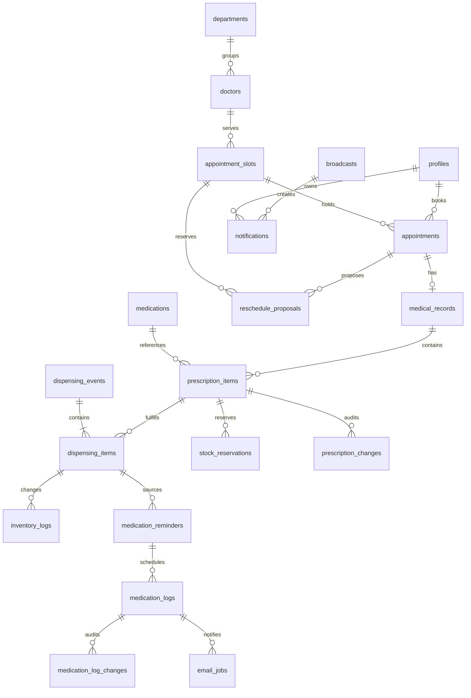

# 03. แบบข้อมูลและ ER

ปรับปรุง 6 กันยายน 2569 (2026-09-06) — ทีมรับรองแบบแยกตารางแล้ว การมี migration ยังไม่ใช่หลักฐานว่าฐานจริงถูกอัปเกรดหรือผ่านการตรวจรับ

## สถานะ

ทีมรับรองแบบแยกตารางตามเอกสารออกแบบวันที่ 6 กันยายน 2569 แล้ว ฐานเดิม 11 ตารางยังคงอยู่เพื่อ compatibility และเพิ่มตารางธุรกรรมด้วย `supabase/migrations/03_normalized_transactions.sql` โดยไม่ backfill JSONB เพราะฐานปัจจุบันมีแต่ข้อมูลทดลอง

## ข้อมูลฐานเดิมและส่วนที่ต้องปรับ

| Entity | ข้อมูลหลัก/ความสัมพันธ์ | ผลจากข้อสรุป |
| --- | --- | --- |
| profiles | id → auth.users; full_name, phone, role, student_id, allergies, chronic_diseases | เพิ่มประเภทผู้ป่วย รหัสบุคลากร หน่วยงาน มี/ไม่มี/ไม่ทราบ และสถานะบัญชี/รุ่นสิทธิ์; จำกัดข้อมูลอ่านตามบทบาท |
| departments | id, name, description | คง 4 แผนกตาม Catalog; ปิดใช้งานโดยรักษาประวัติ |
| doctors | id → profiles, department_id → departments, specialty | สังกัดหนึ่งแผนกตามฐานเดิม |
| appointment_slots | doctor_id, slot_date, start_time, end_time, max_capacity, booked_count, status | available/full/closed; วันไทย ไม่มีข้ามวัน; คิดความจุรวมที่กันไว้ |
| appointments | user_id → profiles, slot_id, queue_number, reason, status | pending/confirmed/in_progress/completed/cancelled/no_show/rejected; ต้องเชื่อมประวัติข้อเสนอเลื่อนนัด |
| medical_records | appointment_id, patient_id, doctor_id, diagnosis, treatment, prescribed_medications | หนึ่งนัดต่อผลตรวจ; JSONB เดิมไม่พออธิบายประวัติแบ่งจ่ายด้วยสถานะทั้งใบเพียงค่าเดียว |
| medications | id, name, type, category, stock, min_stock, expiry_date, is_active | แยกยอดคงคลังกับยอดพร้อมจ่ายหลังหักการกัน |
| inventory_logs | medication_id, quantity_change, transaction_type, performed_by, timestamp | ผูกการจ่ายจริงแต่ละครั้งและเหตุผล ไม่ลงการกันเป็นการจ่าย |
| medication_reminders | user_id, medication_id, times, start/end | ผูกยาที่จ่ายจริง ผู้สร้าง Staff ผู้ยืนยันและเวลายืนยัน; ล็อกหลังยืนยัน |
| medication_logs | reminder_id, scheduled_time, actual_time, status | pending/taken/missed; เส้นตายบันทึกและประวัติแก้ ไม่ใช้ skipped แทน missed |
| notifications | user_id, type, title, message, is_read, created_at | เจ้าของกล่องเท่านั้น; ผูกเหตุการณ์เพื่อกันซ้ำและแยกประวัติ Broadcast กลาง |

ชื่อ field/status ที่รับรองอยู่ใน migration 03 และ `src/types/database.ts`; ตารางสรุปนี้ใช้อธิบายหน้าที่

## ER ข้อมูลธุรกรรมที่รับรอง

## Data Dictionary ส่วนที่รับรองเพิ่ม

| Entity เสนอ | ข้อมูลที่ต้องเก็บ |
| --- | --- |
| reschedule_proposals | appointment, old/new slot, ผู้เสนอ, sent_at, response_deadline = sent_at + 24h, ผลตอบ/ยืนยันอัตโนมัติ, เวลาสิ้นสุดการกัน, version |
| prescription_items | medical_record, medication, จำนวนสั่ง/หน่วย/คำสั่งใช้, version; จำนวนจ่ายแล้ว ค้าง ยกเลิกค้างคำนวณจากประวัติ |
| dispensing_events / dispensing_items | รหัสการจ่ายแต่ละครั้ง ผู้จ่าย เวลา รายการยา จำนวนจริง เหตุผลแบ่งจ่าย และ idempotency key |
| stock_reservations | รายการยา จำนวนกัน ผู้ยืนยันพร้อมจ่าย เวลา สถานะกัน/ใช้/ปล่อยและเหตุผล |
| prescription_changes | รายการ/เวอร์ชัน ก่อน–หลัง เหตุผล ผู้แก้ เวลา ไม่แก้ทับส่วนที่จ่ายแล้ว |
| medication_log_changes | มื้อ ก่อน–หลัง actual_time ผู้แก้ เวลา เหตุผล/ชนิดการแก้ |
| email_jobs | เหตุการณ์/มื้อ ผู้รับ scheduled_at ชนิดปกติ/ซ้ำ/เจ้าหน้าที่ สถานะ attempt ผู้ให้บริการและข้อผิดพลาด |
| broadcasts | ผู้ส่ง เนื้อหา request key; สร้าง notification รายคนด้วย unique (broadcast_id, user_id) |

ข้อมูลพักอีเมลต้องมี pause_until; การส่งโดย Staff ต้องบันทึกผู้ส่ง เหตุผล และข้อจำกัด 1 ครั้งต่อมื้อทั้งระบบ จะเก็บในตารางใดให้รับรองพร้อมแบบสุดท้าย

## Invariants ที่แบบสุดท้ายต้องรองรับ

- 0 ≤ จำนวนจอง/กันที่ ≤ ความจุ; การกดซ้ำไม่เพิ่มหรือลดความจุซ้ำ รอบ closed ไม่เปิดเองเมื่อคืนที่
- จำนวนค้าง = จำนวนสั่ง − จ่ายแล้ว − ยกเลิกค้าง โดยทุกส่วนไม่ติดลบ การแก้ใบสั่งสร้างประวัติ/เวอร์ชันและคงการจ่ายเดิม
- ยอดพร้อมจ่าย = stock − จำนวนกันที่ยังมีผล; การจ่าย การกันและการปล่อยทำภายในธุรกรรม ตรวจ version และสิทธิ์ซ้ำ
- ห้ามจ่ายเกินค้างหรือใช้ยาที่กันให้คนอื่น; การกดคำขอเดิมซ้ำไม่ตัดสต๊อกซ้ำ แต่การรับยาค้างครั้งใหม่ทำได้
- หนึ่งมื้อต่อรายการเตือนและเวลาที่กำหนด; หนึ่งผู้รับต่อ Broadcast; งานส่งแต่ละชนิดต้องมีรหัสกันซ้ำ
- แยกผลวินิจฉัยจากข้อมูลจ่ายยาให้ Staff/Pharmacist อ่านเฉพาะช่องที่อนุญาต RLS รายแถวอย่างเดียวไม่จำกัดคอลัมน์ในแถว
- ข้อมูลเวลาเหตุการณ์ใช้ timestamp ที่ระบุเขตเวลา ส่วนแสดงวัน/เส้นตายใช้ Asia/Bangkok

## แผน migration

เพิ่ม migration 03 แบบ additive และ types แล้ว โดยไม่แก้ migration เดิม ไม่ backfill JSONB และไม่รันกับฐานจริง ขั้นต่อไปคือตรวจ RLS/views/RPC, ทดสอบติดตั้งใหม่ และให้หัวหน้าทีมรันกับฐานทดลองเมื่ออนุมัติ ดู [09](09_implementation_plan.md)

## โครงสร้างและคำอธิบาย Data Dictionary (Data Dictionary Specification)

Data Dictionary (พจนานุกรมข้อมูล) เป็นเอกสารอธิบายรายละเอียดโครงสร้างข้อมูลของแต่ละ Entity/Table ในระบบฐานข้อมูล เพื่อให้ทุกฝ่ายเข้าใจตรงกัน มีองค์ประกอบ 8 คอลัมน์มาตรฐานตามรูปแบบเอกสารวิชาการ:

| คอลัมน์ | ความหมายและคำอธิบาย |
| --- | --- |
| **Attribute** | ชื่อฟิลด์หรือคอลัมน์ในตารางฐานข้อมูล |
| **Description** | หน้าที่ ความหมาย และคำอธิบายการใช้งานของข้อมูล |
| **Key** | ประเภทของคีย์ ได้แก่ Primary Key (`PK`), Foreign Key (`FK (ตารางอ้างอิง)`) |
| **Type (size)** | ชนิดข้อมูลและขนาดของข้อมูล เช่น `UUID`, `TEXT(25)`, `INTEGER`, `DATE`, `TIME`, `BOOLEAN`, `TIMESTAMP WITH TIME ZONE` |
| **Unique** | ข้อกำหนดห้ามข้อมูลซ้ำในตาราง (`Yes` = ห้ามซ้ำ, เว้นว่าง = ซ้ำได้) |
| **Not Null** | ข้อกำหนดการบังคับต้องมีข้อมูล (`Yes` = ห้ามเป็นค่าว่าง, เว้นว่าง = เป็น null ได้) |
| **Validation** | เงื่อนไขตรวจสอบความถูกต้อง เช่น CHECK constraint, รายการค่า Enum หรือรูปแบบข้อมูล |
| **Example** | ตัวอย่างข้อมูลจริงหรือข้อมูลจำลอง |

---

## Data Dictionary ของระบบฐานข้อมูล (Entities)

### 1. Department Entity (`departments`)

เก็บข้อมูลแผนกการรักษาในคลินิก

| Attribute | Description | Key | Type (size) | Unique | Not Null | Validation | Example |
| --- | --- | --- | --- | --- | --- | --- | --- |
| `id` | รหัสประจำแผนก | PK | UUID | Yes | Yes | `gen_random_uuid()` | `a1b2c3d4-e5f6-7a8b-9c0d-1e2f3a4b5c6d` |
| `name` | ชื่อแผนกการรักษา | | TEXT(100) | Yes | Yes | ห้ามเป็นค่าว่าง | `แผนกอายุรกรรมทั่วไป` |
| `description` | รายละเอียดขอบเขตการตรวจรักษาของแผนก | | TEXT | | | | `ตรวจรักษาโรคทั่วไปและให้คำปรึกษาทางสุขภาพ` |
| `is_active` | สถานะเปิด/ปิดการใช้งานแผนก | | BOOLEAN | | Yes | DEFAULT `true` | `true` |
| `created_at` | วันเวลาที่สร้างข้อมูล | | TIMESTAMP WITH TIME ZONE | | Yes | DEFAULT `now()` | `2026-09-06T08:00:00+07:00` |
| `updated_at` | วันเวลาที่แก้ไขข้อมูลล่าสุด | | TIMESTAMP WITH TIME ZONE | | Yes | DEFAULT `now()` | `2026-09-06T08:00:00+07:00` |

### 2. Doctor Entity (`doctors`)

เก็บข้อมูลแพทย์เฉพาะทางและความสัมพันธ์กับแผนกการรักษา

| Attribute | Description | Key | Type (size) | Unique | Not Null | Validation | Example |
| --- | --- | --- | --- | --- | --- | --- | --- |
| `id` | รหัสแพทย์ (ตรงกับรหัสผู้ใช้ใน profiles) | PK, FK (profiles.id) | UUID | Yes | Yes | มีบัญชีใน profiles บทบาท doctor | `d1111111-1111-1111-1111-111111111111` |
| `department_id` | แผนกการรักษาที่แพทย์สังกัด | FK (departments.id) | UUID | | | สังกัด 1 แผนกตามกติกาปัจจุบัน | `a1b2c3d4-e5f6-7a8b-9c0d-1e2f3a4b5c6d` |
| `specialty` | ความเชี่ยวชาญเฉพาะทาง | | TEXT(150) | | | | `อายุรศาสตร์ทั่วไป` |
| `created_at` | วันเวลาที่สร้างข้อมูล | | TIMESTAMP WITH TIME ZONE | | Yes | DEFAULT `now()` | `2026-09-06T08:00:00+07:00` |
| `updated_at` | วันเวลาที่แก้ไขข้อมูลล่าสุด | | TIMESTAMP WITH TIME ZONE | | Yes | DEFAULT `now()` | `2026-09-06T08:00:00+07:00` |

### 3. Profile Entity (`profiles`)

เก็บข้อมูลผู้ใช้งานระบบทุกบทบาท ขยายจาก Supabase Auth (`auth.users`)

| Attribute | Description | Key | Type (size) | Unique | Not Null | Validation | Example |
| --- | --- | --- | --- | --- | --- | --- | --- |
| `id` | รหัสผู้ใช้งาน | PK, FK (auth.users.id) | UUID | Yes | Yes | ผูกกับระบบพิสูจน์ตัวตน | `u1111111-1111-1111-1111-111111111111` |
| `full_name` | ชื่อและนามสกุลจริง | | TEXT(150) | | Yes | ห้ามเป็นค่าว่าง | `นายสมชาย ใจดี` |
| `student_id` | รหัสนักศึกษา | | TEXT(20) | Yes | | ตัวเลข 8 หลัก (เฉพาะนักศึกษา) | `65114440` |
| `employee_id` | รหัสบุคลากร | | TEXT(20) | Yes | | เฉพาะบุคลากร/เจ้าหน้าที่ | `EMP00123` |
| `organization` | สังกัด/หน่วยงาน | | TEXT(150) | | | บังคับสำหรับบุคลากร | `สำนักวิชาสารสนเทศศาสตร์` |
| `phone` | เบอร์โทรศัพท์ติดต่อ | | TEXT(20) | | | รูปแบบเบอร์โทร 10 หลัก | `0812345678` |
| `emergency_phone` | เบอร์โทรศัพท์ติดต่อฉุกเฉิน | | TEXT(20) | | | รูปแบบเบอร์โทร 10 หลัก | `0898765432` |
| `address` | ที่อยู่สำหรับติดต่อ | | TEXT | | | | `222 ม.วลัยลักษณ์ ต.ไทยบุรี อ.ท่าศาลา จ.นครศรีธรรมราช` |
| `patient_type` | ประเภทผู้ป่วย | | TEXT | | | `student`, `employee` | `student` |
| `employee_id` | รหัสบุคลากร | | TEXT | | | บังคับสำหรับบุคลากร | `EMP00123` |
| `organization` | สังกัด/หน่วยงาน | | TEXT | | | บังคับสำหรับบุคลากร | `สำนักวิชาสารสนเทศศาสตร์` |
| `allergy_status` | สถานะการแพ้ยา | | TEXT | | | `yes`, `no`, `unknown` | `yes` |
| `allergies` | รายละเอียดประวัติการแพ้ยา | | TEXT | | | บังคับกรอกถ้า allergy_status = `yes` | `แพ้ยา Penicillin และ Amoxicillin` |
| `chronic_disease_status` | สถานะโรคประจำตัว | | TEXT | | | `yes`, `no`, `unknown` | `no` |
| `chronic_diseases` | รายละเอียดโรคประจำตัว | | TEXT | | | บังคับกรอกถ้า chronic_disease_status = `yes` | `ความดันโลหิตสูง` |
| `role` | บทบาทหน้าที่ในระบบ | | TEXT | | Yes | DEFAULT `'patient'`, `patient`, `staff`, `doctor`, `pharmacist`, `admin` | `patient` |
| `avatar_url` | URL รูปภาพประจำตัว | | TEXT | | | URL รูปภาพ | `https://.../avatar.png` |
| `is_active` | สถานะเปิดใช้งานบัญชี | | BOOLEAN | | Yes | DEFAULT `true` | `true` |
| `permission_version` | ลำดับเวอร์ชันสิทธิ์เพื่อยกเลิก session เดิมทันที | | INTEGER | | Yes | `permission_version > 0`, DEFAULT `1` | `1` |
| `created_at` | วันเวลาที่สร้างบัญชี | | TIMESTAMP WITH TIME ZONE | | Yes | DEFAULT `now()` | `2026-09-06T08:00:00+07:00` |
| `updated_at` | วันเวลาที่แก้ไขข้อมูลล่าสุด | | TIMESTAMP WITH TIME ZONE | | Yes | DEFAULT `now()` | `2026-09-06T08:00:00+07:00` |

### 4. Appointment Slot Entity (`appointment_slots`)

เก็บรอบเวลาตรวจของแพทย์แต่ละท่าน

| Attribute | Description | Key | Type (size) | Unique | Not Null | Validation | Example |
| --- | --- | --- | --- | --- | --- | --- | --- |
| `id` | รหัสรอบเวลาตรวจ | PK | UUID | Yes | Yes | `gen_random_uuid()` | `s1111111-1111-1111-1111-111111111111` |
| `doctor_id` | แพทย์ประจำรอบตรวจ | FK (doctors.id) | UUID | | Yes | | `d1111111-1111-1111-1111-111111111111` |
| `slot_date` | วันที่ตรวจ | | DATE | | Yes | จองล่วงหน้า 1–14 วัน โซน Asia/Bangkok | `2026-09-10` |
| `start_time` | เวลาเริ่มต้นรอบตรวจ | | TIME | | Yes | `start_time < end_time` | `09:00:00` |
| `end_time` | เวลาสิ้นสุดรอบตรวจ | | TIME | | Yes | `start_time < end_time` | `10:00:00` |
| `max_capacity` | ความจุผู้ป่วยสูงสุดต่อรอบ | | INTEGER | | Yes | `max_capacity >= 1` | `5` |
| `booked_count` | จำนวนนัดหมายที่จองหรือกันที่แล้ว | | INTEGER | | Yes | `0 <= booked_count <= max_capacity` | `2` |
| `status` | สถานะของรอบตรวจ | | TEXT(20) | | Yes | `available`, `full`, `closed` | `available` |
| `created_at` | วันเวลาที่สร้างรอบตรวจ | | TIMESTAMP WITH TIME ZONE | | Yes | DEFAULT `now()` | `2026-09-06T08:00:00+07:00` |
| `updated_at` | วันเวลาที่แก้ไขข้อมูลล่าสุด | | TIMESTAMP WITH TIME ZONE | | Yes | DEFAULT `now()` | `2026-09-06T08:00:00+07:00` |

### 5. Appointment Entity (`appointments`)

เก็บข้อมูลการนัดหมายของผู้ป่วยในแต่ละรอบเวลา

| Attribute | Description | Key | Type (size) | Unique | Not Null | Validation | Example |
| --- | --- | --- | --- | --- | --- | --- | --- |
| `id` | รหัสการนัดหมาย | PK | UUID | Yes | Yes | `gen_random_uuid()` | `ap111111-1111-1111-1111-111111111111` |
| `user_id` | ผู้ป่วยที่นัดหมาย | FK (profiles.id) | UUID | | Yes | | `u1111111-1111-1111-1111-111111111111` |
| `slot_id` | รอบเวลาตรวจที่จอง | FK (appointment_slots.id) | UUID | | Yes | | `s1111111-1111-1111-1111-111111111111` |
| `queue_number` | ลำดับคิวตรวจในรอบนั้น | | INTEGER | | | จำนวนเต็มบวก | `1` |
| `reason` | อาการเบื้องต้นหรือเหตุผลที่มาตรวจ | | TEXT | | | | `มีไข้สูง ไอ เจ็บคอ 2 วัน` |
| `status` | สถานะการนัดหมาย | | TEXT(25) | | Yes | `pending`, `confirmed`, `in_progress`, `completed`, `cancelled`, `no_show`, `rejected` | `confirmed` |
| `created_at` | วันเวลาที่ทำการจองนัด | | TIMESTAMP WITH TIME ZONE | | Yes | DEFAULT `now()` | `2026-09-06T08:00:00+07:00` |
| `updated_at` | วันเวลาที่แก้ไขสถานะล่าสุด | | TIMESTAMP WITH TIME ZONE | | Yes | DEFAULT `now()` | `2026-09-06T08:00:00+07:00` |

### 6. Medical Record Entity (`medical_records`)

เก็บบันทึกผลการตรวจรักษาและการวินิจฉัยของแพทย์ (1 นัดหมายมี 1 ผลตรวจ)

| Attribute | Description | Key | Type (size) | Unique | Not Null | Validation | Example |
| --- | --- | --- | --- | --- | --- | --- | --- |
| `id` | รหัสผลการตรวจรักษา | PK | UUID | Yes | Yes | `gen_random_uuid()` | `mr111111-1111-1111-1111-111111111111` |
| `appointment_id` | นัดหมายที่ตรวจรักษา | FK (appointments.id) | UUID | Yes | Yes | 1 ผลตรวจต่อนัดหมาย | `ap111111-1111-1111-1111-111111111111` |
| `patient_id` | ผู้ป่วยที่ได้รับการตรวจ | FK (profiles.id) | UUID | | Yes | | `u1111111-1111-1111-1111-111111111111` |
| `doctor_id` | แพทย์ผู้บันทึกผลตรวจ | FK (doctors.id) | UUID | | Yes | เฉพาะแพทย์ประจำนัดหมาย | `d1111111-1111-1111-1111-111111111111` |
| `diagnosis` | ข้อความวินิจฉัยโรค (ผู้ป่วยเห็นหลังปิดตรวจ) | | TEXT | | | ซ่อนจาก Staff/Pharmacist | `Acute Pharyngitis (คออักเสบเฉียบพลัน)` |
| `treatment_notes` | บันทึกการรักษาและคำแนะนำ | | TEXT | | | | `พักผ่อน ดื่มน้ำอุ่น รับประทานยาตามสั่ง` |
| `prescribed_medications` | โครงสร้าง JSONB ข้อมูลสั่งยาเดิม (อ้างอิงประวัติ) | | JSONB | | | ใช้คู่กับ `prescription_items` | `[{"medication_id": "...", "quantity": 10}]` |
| `created_at` | วันเวลาที่บันทึกผลตรวจ | | TIMESTAMP WITH TIME ZONE | | Yes | DEFAULT `now()` | `2026-09-06T08:00:00+07:00` |
| `updated_at` | วันเวลาที่แก้ไขผลตรวจล่าสุด | | TIMESTAMP WITH TIME ZONE | | Yes | DEFAULT `now()` | `2026-09-06T08:00:00+07:00` |

### 7. Medication Entity (`medications`)

เก็บข้อมูลยาและเวชภัณฑ์ในคลังของคลินิก

| Attribute | Description | Key | Type (size) | Unique | Not Null | Validation | Example |
| --- | --- | --- | --- | --- | --- | --- | --- |
| `id` | รหัสยา | PK | UUID | Yes | Yes | `gen_random_uuid()` | `m1111111-1111-1111-1111-111111111111` |
| `name` | ชื่อยาและขนาดความแรง | | TEXT(150) | | Yes | ห้ามเป็นค่าว่าง | `Paracetamol 500 mg` |
| `type` | รูปแบบยา | | TEXT(50) | | Yes | เช่น ยาเม็ด, ยาน้ำ, แคปซูล | `ยาเม็ด` |
| `category` | หมวดหมู่ยา | | TEXT(50) | | Yes | เช่น ยาสามัญประจำบ้าน, ยาอันตราย | `ยาสามัญประจำบ้าน` |
| `stock` | ยอดคงคลังจริง | | INTEGER | | Yes | `stock >= 0` | `500` |
| `min_stock` | จุดแจ้งเตือนสต๊อกต่ำ | | INTEGER | | Yes | `min_stock >= 0` | `50` |
| `expiry_date` | วันหมดอายุของยา | | DATE | | | รูปแบบวันที่ | `2027-12-31` |
| `description` | สรรพคุณและข้อบ่งใช้ | | TEXT | | | | `บรรเทาอาการปวด ลดไข้` |
| `ingredients` | ตัวยาสำคัญ | | TEXT | | | | `Paracetamol 500 mg` |
| `is_active` | สถานะเปิดใช้งานในรายการยา | | BOOLEAN | | | DEFAULT `true` | `true` |
| `created_at` | วันเวลาที่เพิ่มรายการยา | | TIMESTAMP WITH TIME ZONE | | Yes | DEFAULT `now()` | `2026-09-06T08:00:00+07:00` |
| `updated_at` | วันเวลาที่อัปเดตข้อมูลยา | | TIMESTAMP WITH TIME ZONE | | Yes | DEFAULT `now()` | `2026-09-06T08:00:00+07:00` |

### 8. Inventory Log Entity (`inventory_logs`)

เก็บบันทึกประวัติความเคลื่อนไหวการรับเข้าและตัดจ่ายยาในคลัง

| Attribute | Description | Key | Type (size) | Unique | Not Null | Validation | Example |
| --- | --- | --- | --- | --- | --- | --- | --- |
| `id` | รหัสประวัติความเคลื่อนไหว | PK | UUID | Yes | Yes | `gen_random_uuid()` | `log11111-1111-1111-1111-111111111111` |
| `medication_id` | รหัสยาที่ทำรายการ | FK (medications.id) | UUID | | Yes | | `m1111111-1111-1111-1111-111111111111` |
| `pharmacist_id` | เภสัชกรผู้ทำรายการ (ฟิลด์เดิม) | FK (profiles.id) | UUID | | Yes | | `u2222222-2222-2222-2222-222222222222` |
| `performed_by` | ผู้ดำเนินการจริง | FK (profiles.id) | UUID | | | บันทึกผู้ทำรายการ | `u2222222-2222-2222-2222-222222222222` |
| `action` | ชนิดการทำรายการ | | TEXT(20) | | Yes | `add`, `dispense`, `adjust`, `damage` | `dispense` |
| `quantity` | จำนวนที่ปรับเปลี่ยน (ตัดจ่ายติดลบ รับเข้าเป็นบวก) | | INTEGER | | Yes | `quantity <> 0` | `-20` |
| `reason` | เหตุผลในการปรับยอดคลัง | | TEXT | | | | `จ่ายยาตามใบสั่งแพทย์` |
| `dispensing_item_id` | รายการจ่ายยาจริงที่เชื่อมโยง | FK (dispensing_items.id) | UUID | | | ผูกกับรายการตัดจ่ายจริง | `di111111-1111-1111-1111-111111111111` |
| `idempotency_key` | รหัสป้องกันการตัดสต๊อกซ้ำ | | TEXT(100) | Yes | | คีย์ไม่ซ้ำกันในแต่ละคำขอ | `dispense-item-di111111` |
| `created_at` | วันเวลาที่บันทึกรายการ | | TIMESTAMP WITH TIME ZONE | | Yes | DEFAULT `now()` | `2026-09-06T08:00:00+07:00` |

### 9. Medication Reminder Entity (`medication_reminders`)

เก็บรายการตั้งเวลาเตือนกินยาของผู้ป่วย สร้างโดย Staff จากยาที่จ่ายจริง

| Attribute | Description | Key | Type (size) | Unique | Not Null | Validation | Example |
| --- | --- | --- | --- | --- | --- | --- | --- |
| `id` | รหัสรายการเตือนกินยา | PK | UUID | Yes | Yes | `gen_random_uuid()` | `rem11111-1111-1111-1111-111111111111` |
| `user_id` | ผู้ป่วยเจ้าของรายการเตือน | FK (profiles.id) | UUID | | Yes | | `u1111111-1111-1111-1111-111111111111` |
| `medication_id` | ยาที่ต้องรับประทาน | FK (medications.id) | UUID | | Yes | | `m1111111-1111-1111-1111-111111111111` |
| `dispensing_item_id` | รายการยาที่จ่ายจริงที่เป็นที่มา | FK (dispensing_items.id) | UUID | | | ยาค้างจ่ายยังไม่เริ่มเตือน | `di111111-1111-1111-1111-111111111111` |
| `reminder_times` | เวลาเตือนแต่ละมื้อของวัน | | TEXT[] | | Yes | ชุดข้อความเวลา `['08:00', ...]` | `['08:00', '12:00', '20:00']` |
| `start_date` | วันที่เริ่มรับประทานยา | | DATE | | Yes | | `2026-09-07` |
| `end_date` | วันที่สิ้นสุดการรับประทานยา | | DATE | | | `end_date >= start_date` | `2026-09-14` |
| `status` | สถานะรายการเตือน | | TEXT | | Yes | `pending_confirmation`, `active`, `completed`, `cancelled`, `paused` | `active` |
| `created_by` | เจ้าหน้าที่ผู้ตั้งรายการเตือน | FK (profiles.id) | UUID | | | สิทธิ์ Staff | `u3333333-3333-3333-3333-333333333333` |
| `confirmed_by` | ผู้ป่วยที่กดยืนยันเวลาเตือน | FK (profiles.id) | UUID | | | สิทธิ์ Patient | `u1111111-1111-1111-1111-111111111111` |
| `confirmed_at` | วันเวลาที่ยืนยัน | | TIMESTAMP WITH TIME ZONE | | | | `2026-09-07T07:30:00+07:00` |
| `locked_at` | วันเวลาที่ล็อกเวลาเตือน (ห้ามแก้เวลาเพิ่ม) | | TIMESTAMP WITH TIME ZONE | | | ล็อกพร้อมเวลายืนยัน | `2026-09-07T07:30:00+07:00` |
| `email_pause_until` | เวลาสิ้นสุดการพักส่งอีเมลเตือน | | TIMESTAMP WITH TIME ZONE | | | พักได้ 1/8/24 ชั่วโมง | `2026-09-07T16:00:00+07:00` |
| `created_at` | วันเวลาที่สร้างรายการ | | TIMESTAMP WITH TIME ZONE | | Yes | DEFAULT `now()` | `2026-09-06T08:00:00+07:00` |
| `updated_at` | วันเวลาที่อัปเดตล่าสุด | | TIMESTAMP WITH TIME ZONE | | Yes | DEFAULT `now()` | `2026-09-06T08:00:00+07:00` |

### 10. Medication Log Entity (`medication_logs`)

เก็บบันทึกประวัติการกินยาในแต่ละมื้อตามเวลาเตือน

| Attribute | Description | Key | Type (size) | Unique | Not Null | Validation | Example |
| --- | --- | --- | --- | --- | --- | --- | --- |
| `id` | รหัสบันทึกมื้อการกินยา | PK | UUID | Yes | Yes | `gen_random_uuid()` | `mlog1111-1111-1111-1111-111111111111` |
| `reminder_id` | รายการเตือนที่สังกัด | FK (medication_reminders.id) | UUID | | Yes | | `rem11111-1111-1111-1111-111111111111` |
| `scheduled_datetime` | วันเวลาที่กำหนดให้กินยา | | TIMESTAMP WITH TIME ZONE | | Yes | เวลาไทย Asia/Bangkok | `2026-09-07T08:00:00+07:00` |
| `actual_datetime` | วันเวลาที่ผู้ป่วยบันทึกว่ากินจริง | | TIMESTAMP WITH TIME ZONE | | | บันทึกย้อนหลังได้ไม่เกิน deadline | `2026-09-07T08:15:00+07:00` |
| `status` | สถานะมื้อ | | TEXT(20) | | Yes | `pending`, `taken`, `missed` | `taken` |
| `record_deadline` | เส้นตายบันทึกมื้อ | | TIMESTAMP WITH TIME ZONE | | | เวลาเตือนมื้อถัดไป + 30 นาที | `2026-09-07T12:30:00+07:00` |
| `revision` | ลำดับการแก้ไขบันทึก | | INTEGER | | Yes | DEFAULT `1` | `1` |
| `created_at` | วันเวลาที่สร้างบันทึกมื้อ | | TIMESTAMP WITH TIME ZONE | | Yes | DEFAULT `now()` | `2026-09-06T08:00:00+07:00` |
| `updated_at` | วันเวลาที่อัปเดตล่าสุด | | TIMESTAMP WITH TIME ZONE | | Yes | DEFAULT `now()` | `2026-09-06T08:00:00+07:00` |

### 11. Notification Entity (`notifications`)

เก็บข้อมูลข้อความแจ้งเตือนภายในระบบของผู้ใช้แต่ละราย

| Attribute | Description | Key | Type (size) | Unique | Not Null | Validation | Example |
| --- | --- | --- | --- | --- | --- | --- | --- |
| `id` | รหัสข้อความแจ้งเตือน | PK | UUID | Yes | Yes | `gen_random_uuid()` | `notif111-1111-1111-1111-111111111111` |
| `user_id` | ผู้ใช้เจ้าของกล่องข้อความ | FK (profiles.id) | UUID | | Yes | เจ้าของกล่องอ่าน/ลบได้เฉพาะตนเอง | `u1111111-1111-1111-1111-111111111111` |
| `type` | ประเภทการแจ้งเตือน | | TEXT(30) | | Yes | `reminder`, `appointment`, `broadcast`, `system` | `appointment` |
| `title` | หัวข้อการแจ้งเตือน | | TEXT(150) | | Yes | ห้ามเป็นค่าว่าง | `ยืนยันการนัดหมายสำเร็จ` |
| `message` | รายละเอียดข้อความ | | TEXT | | Yes | ห้ามเป็นค่าว่าง | `นัดหมายของคุณวันที่ 10 ก.ย. ได้รับการยืนยันแล้ว` |
| `is_read` | สถานะการเปิดอ่าน | | BOOLEAN | | Yes | DEFAULT `false` | `false` |
| `event_key` | รหัสเหตุการณ์กันส่งข้อความซ้ำ | | TEXT(100) | | | Idempotency event key | `appt-confirmed-ap111111` |
| `broadcast_id` | รหัสประกาศ Broadcast ที่เชื่อมโยง | FK (broadcasts.id) | UUID | | | ผูกกับประกาศส่วนกลาง, `UNIQUE (broadcast_id, user_id)` | `bc111111-1111-1111-1111-111111111111` |
| `read_at` | วันเวลาที่เปิดอ่าน | | TIMESTAMP WITH TIME ZONE | | | บันทึกเมื่อ `is_read` = true | `2026-09-07T09:00:00+07:00` |
| `deleted_at` | วันเวลาที่ลบข้อความออกจากกล่อง | | TIMESTAMP WITH TIME ZONE | | | Soft-delete กล่องผู้ใช้ | null |
| `created_at` | วันเวลาที่สร้างข้อความ | | TIMESTAMP WITH TIME ZONE | | Yes | DEFAULT `now()` | `2026-09-06T08:00:00+07:00` |

---

## Data Dictionary ของตารางธุรกรรมที่รับรองเพิ่ม (Transaction Entities)

### 12. Reschedule Proposal Entity (`reschedule_proposals`)

เก็บข้อเสนอเลื่อนนัดเมื่อแพทย์งดตรวจ พร้อมประวัติการกันที่และผลการตอบรับของผู้ป่วย

| Attribute | Description | Key | Type (size) | Unique | Not Null | Validation | Example |
| --- | --- | --- | --- | --- | --- | --- | --- |
| `id` | รหัสข้อเสนอเลื่อนนัด | PK | UUID | Yes | Yes | `gen_random_uuid()` | `rp111111-1111-1111-1111-111111111111` |
| `appointment_id` | นัดหมายที่เสนอเลื่อน | FK (appointments.id) | UUID | | Yes | | `ap111111-1111-1111-1111-111111111111` |
| `old_slot_id` | รอบตรวจเดิมที่งดตรวจ | FK (appointment_slots.id) | UUID | | Yes | `old_slot_id <> proposed_slot_id` | `s1111111-1111-1111-1111-111111111111` |
| `proposed_slot_id` | รอบตรวจใหม่ที่เจ้าหน้าที่เสนอ | FK (appointment_slots.id) | UUID | | Yes | เริ่มหลัง 24 ชม. จากส่งข้อเสนอ | `s2222222-2222-2222-2222-222222222222` |
| `proposed_by` | เจ้าหน้าที่ผู้ยื่นข้อเสนอ | FK (profiles.id) | UUID | | Yes | สิทธิ์ Staff | `u3333333-3333-3333-3333-333333333333` |
| `sent_at` | วันเวลาที่ส่งข้อเสนอ | | TIMESTAMP WITH TIME ZONE | | Yes | DEFAULT `now()` | `2026-09-06T09:00:00+07:00` |
| `response_deadline` | เส้นตายการตอบกลับของผู้ป่วย | | TIMESTAMP WITH TIME ZONE | | Yes | `sent_at + interval '24 hours'` | `2026-09-07T09:00:00+07:00` |
| `reservation_expires_at` | เวลาสิ้นสุดการกันที่รอบใหม่ | | TIMESTAMP WITH TIME ZONE | | | ปลดการกันเมื่อครบเวลา | `2026-09-07T09:00:00+07:00` |
| `status` | สถานะข้อเสนอ | | TEXT(30) | | Yes | `pending`, `accepted`, `alternative_selected`, `auto_confirmed`, `rejected`, `expired`, `withdrawn`, `superseded` | `pending` |
| `responded_at` | วันเวลาที่ตอบหรือยืนยันอัตโนมัติ | | TIMESTAMP WITH TIME ZONE | | | | `2026-09-06T15:00:00+07:00` |
| `responded_by` | ผู้ตอบข้อเสนอ | FK (profiles.id) | UUID | | | | `u1111111-1111-1111-1111-111111111111` |
| `version` | เวอร์ชันเพื่อป้องกัน race condition | | INTEGER | | Yes | `version > 0`, DEFAULT `1` | `1` |
| `request_key` | รหัสป้องกันส่งคำขอซ้ำ | | TEXT(100) | Yes | Yes | Unique key | `resched-ap111-v1` |
| `created_at` | วันเวลาที่สร้างรายการ | | TIMESTAMP WITH TIME ZONE | | Yes | DEFAULT `now()` | `2026-09-06T09:00:00+07:00` |
| `updated_at` | วันเวลาที่อัปเดตล่าสุด | | TIMESTAMP WITH TIME ZONE | | Yes | DEFAULT `now()` | `2026-09-06T09:00:00+07:00` |

### 13. Prescription Item Entity (`prescription_items`)

เก็บรายการยาแต่ละตัวในใบสั่งยา รองรับการแบ่งจ่าย การกันยา และการยกเลิกค้าง

| Attribute | Description | Key | Type (size) | Unique | Not Null | Validation | Example |
| --- | --- | --- | --- | --- | --- | --- | --- |
| `id` | รหัสรายการยาในใบสั่ง | PK | UUID | Yes | Yes | `gen_random_uuid()` | `pi111111-1111-1111-1111-111111111111` |
| `medical_record_id` | ผลการตรวจรักษาที่สั่งยา | FK (medical_records.id) | UUID | | Yes | | `mr111111-1111-1111-1111-111111111111` |
| `medication_id` | รหัสยาที่สั่ง | FK (medications.id) | UUID | | Yes | | `m1111111-1111-1111-1111-111111111111` |
| `prescribed_quantity` | จำนวนยาที่แพทย์สั่ง | | INTEGER | | Yes | `prescribed_quantity > 0` | `30` |
| `cancelled_quantity` | จำนวนยาค้างจ่ายที่ขอยกเลิก | | INTEGER | | Yes | `0 <= cancelled_quantity <= prescribed_quantity` | `0` |
| `unit` | หน่วยนับของยา | | TEXT(30) | | Yes | เช่น เม็ด, แคปซูล, ขวด | `เม็ด` |
| `dosage` | ขนาดยาที่รับประทานต่อมื้อ | | TEXT(50) | | Yes | | `1 เม็ด` |
| `frequency` | ความถี่ในการรับประทาน | | TEXT(50) | | Yes | เช่น วันละ 3 ครั้ง หลังอาหาร | `วันละ 3 ครั้ง หลังอาหาร` |
| `duration_days` | จำนวนวันที่ต้องรับประทาน | | INTEGER | | | `duration_days > 0` | `10` |
| `instructions` | คำสั่งใช้ยาเพิ่มเติม | | TEXT | | | | `รับประทานติดต่อกันจนหมด` |
| `status` | สถานะรายการยา | | TEXT(25) | | Yes | `active`, `partially_dispensed`, `dispensed`, `cancelled` | `active` |
| `version` | เวอร์ชันสำหรับ concurrency control | | INTEGER | | Yes | `version > 0`, DEFAULT `1` | `1` |
| `created_at` | วันเวลาที่สั่งยา | | TIMESTAMP WITH TIME ZONE | | Yes | DEFAULT `now()` | `2026-09-06T08:00:00+07:00` |
| `updated_at` | วันเวลาที่อัปเดตล่าสุด | | TIMESTAMP WITH TIME ZONE | | Yes | DEFAULT `now()` | `2026-09-06T08:00:00+07:00` |

### 14. Dispensing Event Entity (`dispensing_events`)

เก็บบันทึกประวัติการจ่ายยาจริงแต่ละครั้งโดยเภสัชกร รองรับการแบ่งจ่ายและการจ่ายยาค้าง

| Attribute | Description | Key | Type (size) | Unique | Not Null | Validation | Example |
| --- | --- | --- | --- | --- | --- | --- | --- |
| `id` | รหัสครั้งการจ่ายยา | PK | UUID | Yes | Yes | `gen_random_uuid()` | `de111111-1111-1111-1111-111111111111` |
| `patient_id` | ผู้ป่วยที่มารับยา | FK (profiles.id) | UUID | | Yes | | `u1111111-1111-1111-1111-111111111111` |
| `dispensed_by` | เภสัชกรผู้จ่ายยา | FK (profiles.id) | UUID | | Yes | สิทธิ์ Pharmacist | `u2222222-2222-2222-2222-222222222222` |
| `dispensed_at` | วันเวลาที่จ่ายยา | | TIMESTAMP WITH TIME ZONE | | Yes | DEFAULT `now()` | `2026-09-06T10:00:00+07:00` |
| `reason` | เหตุผลการจ่าย/แบ่งจ่าย | | TEXT | | | บันทึกเมื่อแบ่งจ่าย | `ยาไม่พอ จ่ายส่วนที่มีก่อน` |
| `idempotency_key` | รหัสป้องกันการจ่ายยาซ้ำ | | TEXT(100) | Yes | Yes | Unique key | `disp-event-de111111` |
| `created_at` | วันเวลาที่สร้างประวัติ | | TIMESTAMP WITH TIME ZONE | | Yes | DEFAULT `now()` | `2026-09-06T10:00:00+07:00` |

### 15. Dispensing Item Entity (`dispensing_items`)

เก็บรายการยาและจำนวนที่จ่ายจริงในแต่ละครั้งการจ่ายยา

| Attribute | Description | Key | Type (size) | Unique | Not Null | Validation | Example |
| --- | --- | --- | --- | --- | --- | --- | --- |
| `id` | รหัสรายการยาที่จ่ายจริง | PK | UUID | Yes | Yes | `gen_random_uuid()` | `di111111-1111-1111-1111-111111111111` |
| `dispensing_event_id` | ครั้งการจ่ายยาที่สังกัด | FK (dispensing_events.id) | UUID | | Yes | | `de111111-1111-1111-1111-111111111111` |
| `prescription_item_id` | รายการยาในใบสั่งที่จ่าย | FK (prescription_items.id) | UUID | | Yes | 1 รายการต่อ 1 ครั้งการจ่าย | `pi111111-1111-1111-1111-111111111111` |
| `quantity` | จำนวนยาที่จ่ายจริงครั้งนี้ | | INTEGER | | Yes | `quantity > 0` | `10` |
| `partial_reason` | เหตุผลกรณีจ่ายไม่ครบจำนวน | | TEXT | | | | `สต๊อกมีจำกัด แบ่งจ่ายก่อน 10 เม็ด` |
| `created_at` | วันเวลาที่บันทึก | | TIMESTAMP WITH TIME ZONE | | Yes | DEFAULT `now()` | `2026-09-06T10:00:00+07:00` |

### 16. Stock Reservation Entity (`stock_reservations`)

เก็บข้อมูลการกันยาค้างจ่ายที่พร้อมจ่ายไว้ เพื่อไม่ให้ผู้อื่นเบิกตัดหน้า

| Attribute | Description | Key | Type (size) | Unique | Not Null | Validation | Example |
| --- | --- | --- | --- | --- | --- | --- | --- |
| `id` | รหัสรายการกันยา | PK | UUID | Yes | Yes | `gen_random_uuid()` | `sr111111-1111-1111-1111-111111111111` |
| `prescription_item_id` | รายการยาในใบสั่งที่ต้องการกัน | FK (prescription_items.id) | UUID | | Yes | | `pi111111-1111-1111-1111-111111111111` |
| `medication_id` | รหัสยาที่กันไว้ | FK (medications.id) | UUID | | Yes | | `m1111111-1111-1111-1111-111111111111` |
| `quantity` | จำนวนยาที่กันไว้ | | INTEGER | | Yes | `quantity > 0` | `20` |
| `confirmed_by` | เภสัชกรผู้ยืนยันพร้อมจ่ายและกันยา | FK (profiles.id) | UUID | | Yes | สิทธิ์ Pharmacist | `u2222222-2222-2222-2222-222222222222` |
| `confirmed_at` | วันเวลาที่ทำการยืนยันการกันยา | | TIMESTAMP WITH TIME ZONE | | Yes | DEFAULT `now()` | `2026-09-06T11:00:00+07:00` |
| `status` | สถานะการกันยา | | TEXT | | Yes | DEFAULT `'active'`, `active`, `consumed`, `released`, `expired` | `active` |
| `consumed_at` | วันเวลาที่นำยาที่กันไว้ไปจ่ายจริง | | TIMESTAMP WITH TIME ZONE | | | บันทึกเมื่อตัดจ่ายจริง | null |
| `released_at` | วันเวลาที่ปลดการกันยา | | TIMESTAMP WITH TIME ZONE | | | เมื่อผู้ป่วยขอยกเลิกค้างรับยา | null |
| `release_reason` | เหตุผลในการปลดการกันยา | | TEXT | | | | null |
| `version` | เวอร์ชันสำหรับ concurrency control | | INTEGER | | Yes | `version > 0`, DEFAULT `1` | `1` |
| `created_at` | วันเวลาที่สร้างรายการ | | TIMESTAMP WITH TIME ZONE | | Yes | DEFAULT `now()` | `2026-09-06T11:00:00+07:00` |
| `updated_at` | วันเวลาที่อัปเดตสถานะล่าสุด | | TIMESTAMP WITH TIME ZONE | | Yes | DEFAULT `now()` | `2026-09-06T11:00:00+07:00` |

### 17. Prescription Change Entity (`prescription_changes`)

เก็บประวัติการแก้ไขรายการยาในใบสั่งแพทย์ (Audit Trail) เพื่อคงข้อมูลเดิมและตรวจสอบย้อนหลัง

| Attribute | Description | Key | Type (size) | Unique | Not Null | Validation | Example |
| --- | --- | --- | --- | --- | --- | --- | --- |
| `id` | รหัสประวัติการแก้ไขใบสั่ง | PK | UUID | Yes | Yes | `gen_random_uuid()` | `pc111111-1111-1111-1111-111111111111` |
| `prescription_item_id` | รายการยาที่ถูกแก้ไข | FK (prescription_items.id) | UUID | | Yes | | `pi111111-1111-1111-1111-111111111111` |
| `from_version` | เวอร์ชันก่อนหน้า | | INTEGER | | Yes | | `1` |
| `to_version` | เวอร์ชันหลังแก้ไข | | INTEGER | | Yes | | `2` |
| `before_value` | สแน็ปช็อตข้อมูลก่อนแก้ไข | | JSONB | | Yes | บันทึกค่าเดิมทั้งหมด | `{"dosage": "1 เม็ด", "frequency": "วันละ 2 ครั้ง"}` |
| `after_value` | สแน็ปช็อตข้อมูลหลังแก้ไข | | JSONB | | Yes | บันทึกค่าใหม่ | `{"dosage": "1 เม็ด", "frequency": "วันละ 3 ครั้ง"}` |
| `reason` | เหตุผลในการแก้ไข | | TEXT | | Yes | ห้ามเป็นค่าว่าง | `ปรับขนาดยาตามอาการผู้ป่วย` |
| `changed_by` | แพทย์ผู้ดำเนินการแก้ไข | FK (profiles.id) | UUID | | Yes | สิทธิ์ Doctor | `d1111111-1111-1111-1111-111111111111` |
| `created_at` | วันเวลาที่บันทึกการแก้ไข | | TIMESTAMP WITH TIME ZONE | | Yes | DEFAULT `now()` | `2026-09-06T11:30:00+07:00` |

### 18. Medication Log Change Entity (`medication_log_changes`)

เก็บประวัติการแก้ไขเวลากินจริงหรือสถานะมื้อยาโดยผู้ป่วยหรือเจ้าหน้าที่

| Attribute | Description | Key | Type (size) | Unique | Not Null | Validation | Example |
| --- | --- | --- | --- | --- | --- | --- | --- |
| `id` | รหัสประวัติการแก้ไขมื้อ | PK | UUID | Yes | Yes | `gen_random_uuid()` | `mlc11111-1111-1111-1111-111111111111` |
| `medication_log_id` | มื้อยาที่ถูกแก้ไข | FK (medication_logs.id) | UUID | | Yes | | `mlog1111-1111-1111-1111-111111111111` |
| `before_status` | สถานะมื้อก่อนแก้ไข | | TEXT | | Yes | `pending`, `taken`, `missed` | `pending` |
| `after_status` | สถานะมื้อหลังแก้ไข | | TEXT | | Yes | `pending`, `taken`, `missed` | `taken` |
| `before_actual_datetime` | เวลาที่กินจริงก่อนแก้ไข | | TIMESTAMP WITH TIME ZONE | | | | null |
| `after_actual_datetime` | เวลาที่กินจริงหลังแก้ไข | | TIMESTAMP WITH TIME ZONE | | | บันทึกย้อนหลังในเส้นตาย | `2026-09-07T08:15:00+07:00` |
| `reason` | เหตุผลในการแก้ไข | | TEXT | | Yes | ห้ามเป็นค่าว่าง | `ลืมกดยืนยันตอนกินยา` |
| `changed_by` | ผู้ดำเนินการแก้ไข | FK (profiles.id) | UUID | | Yes | | `u1111111-1111-1111-1111-111111111111` |
| `created_at` | วันเวลาที่แก้ไข | | TIMESTAMP WITH TIME ZONE | | Yes | DEFAULT `now()` | `2026-09-07T08:20:00+07:00` |

### 19. Email Job Entity (`email_jobs`)

เก็บคิวงานและประวัติการส่งอีเมลแจ้งเตือนทุกประเภท (เตือนกินยา, นัดหมาย, ยาค้างพร้อมจ่าย)

| Attribute | Description | Key | Type (size) | Unique | Not Null | Validation | Example |
| --- | --- | --- | --- | --- | --- | --- | --- |
| `id` | รหัสคิวงานอีเมล | PK | UUID | Yes | Yes | `gen_random_uuid()` | `ej111111-1111-1111-1111-111111111111` |
| `recipient_id` | ผู้รับอีเมล | FK (profiles.id) | UUID | | Yes | | `u1111111-1111-1111-1111-111111111111` |
| `medication_log_id` | มื้อยาที่เกี่ยวข้อง (ถ้าเป็นเตือนกินยา) | FK (medication_logs.id) | UUID | | | ผูกกับมื้อยา | `mlog1111-1111-1111-1111-111111111111` |
| `job_type` | ประเภทของงานอีเมล | | TEXT | | Yes | `dose_advance`, `dose_final_repeat`, `staff_override`, `appointment`, `backorder_ready` | `dose_advance` |
| `scheduled_at` | เวลาที่กำหนดส่ง | | TIMESTAMP WITH TIME ZONE | | Yes | ล่วงหน้า 10 นาทีสำหรับเตือนกินยา | `2026-09-07T07:50:00+07:00` |
| `status` | สถานะงาน | | TEXT | | Yes | DEFAULT `'pending'`, `pending`, `processing`, `sent`, `failed`, `cancelled`, `skipped_paused` | `sent` |
| `attempt_count` | จำนวนครั้งที่พยายามส่ง | | INTEGER | | Yes | `attempt_count >= 0`, DEFAULT `0` | `1` |
| `last_attempt_at` | วันเวลาที่พยายามส่งครั้งล่าสุด | | TIMESTAMP WITH TIME ZONE | | | | `2026-09-07T07:50:05+07:00` |
| `sent_at` | วันเวลาที่ส่งสำเร็จ | | TIMESTAMP WITH TIME ZONE | | | | `2026-09-07T07:50:06+07:00` |
| `provider_message_id` | รหัสอ้างอิงจากผู้ให้บริการอีเมล | | TEXT | | | เช่น Message-ID จาก Resend/SMTP | `msg_1234567890` |
| `last_error` | ข้อความผิดพลาดล่าสุดกรณีส่งล้มเหลว | | TEXT | | | | null |
| `requested_by` | เจ้าหน้าที่ผู้ขอส่ง (กรณี override) | FK (profiles.id) | UUID | | | สิทธิ์ Staff | null |
| `request_reason` | เหตุผลการส่งพิเศษ | | TEXT | | | | null |
| `idempotency_key` | รหัสป้องกันการสร้าง/ส่งงานซ้ำ | | TEXT | Yes | Yes | Unique key | `email-job-dose-mlog1111-adv` |
| `created_at` | วันเวลาที่สร้างงาน | | TIMESTAMP WITH TIME ZONE | | Yes | DEFAULT `now()` | `2026-09-06T08:00:00+07:00` |
| `updated_at` | วันเวลาที่อัปเดตล่าสุด | | TIMESTAMP WITH TIME ZONE | | Yes | DEFAULT `now()` | `2026-09-07T07:50:06+07:00` |

### 20. Broadcast Entity (`broadcasts`)

เก็บข้อมูลการประกาศข่าวสารส่วนกลางจากผู้ดูแลระบบ (Admin)

| Attribute | Description | Key | Type (size) | Unique | Not Null | Validation | Example |
| --- | --- | --- | --- | --- | --- | --- | --- |
| `id` | รหัสประกาศ Broadcast | PK | UUID | Yes | Yes | `gen_random_uuid()` | `bc111111-1111-1111-1111-111111111111` |
| `sent_by` | ผู้ส่งประกาศ | FK (profiles.id) | UUID | | Yes | เฉพาะ Admin เท่านั้น | `u4444444-4444-4444-4444-444444444444` |
| `title` | หัวข้อประกาศ | | TEXT | | Yes | ห้ามเป็นค่าว่าง | `แจ้งปิดปรับปรุงระบบชั่วคราว` |
| `message` | เนื้อหาประกาศ | | TEXT | | Yes | ห้ามเป็นค่าว่าง | `ระบบจะปิดปรับปรุงวันที่ 15 ก.ย. เวลา 22:00-02:00 น.` |
| `audience` | กลุ่มเป้าหมายผู้รับ | | JSONB | | Yes | ตรึงเงื่อนไข เช่น `{"target": "all"}` หรือ `{"role": "patient"}` | `{"role": "patient"}` |
| `request_key` | รหัสป้องกันการส่งซ้ำ | | TEXT | Yes | Yes | Unique key | `bc-req-20260906-01` |
| `sent_at` | วันเวลาที่ส่งประกาศ | | TIMESTAMP WITH TIME ZONE | | Yes | DEFAULT `now()` | `2026-09-06T12:00:00+07:00` |
| `created_at` | วันเวลาที่บันทึกข้อมูล | | TIMESTAMP WITH TIME ZONE | | Yes | DEFAULT `now()` | `2026-09-06T12:00:00+07:00` |

