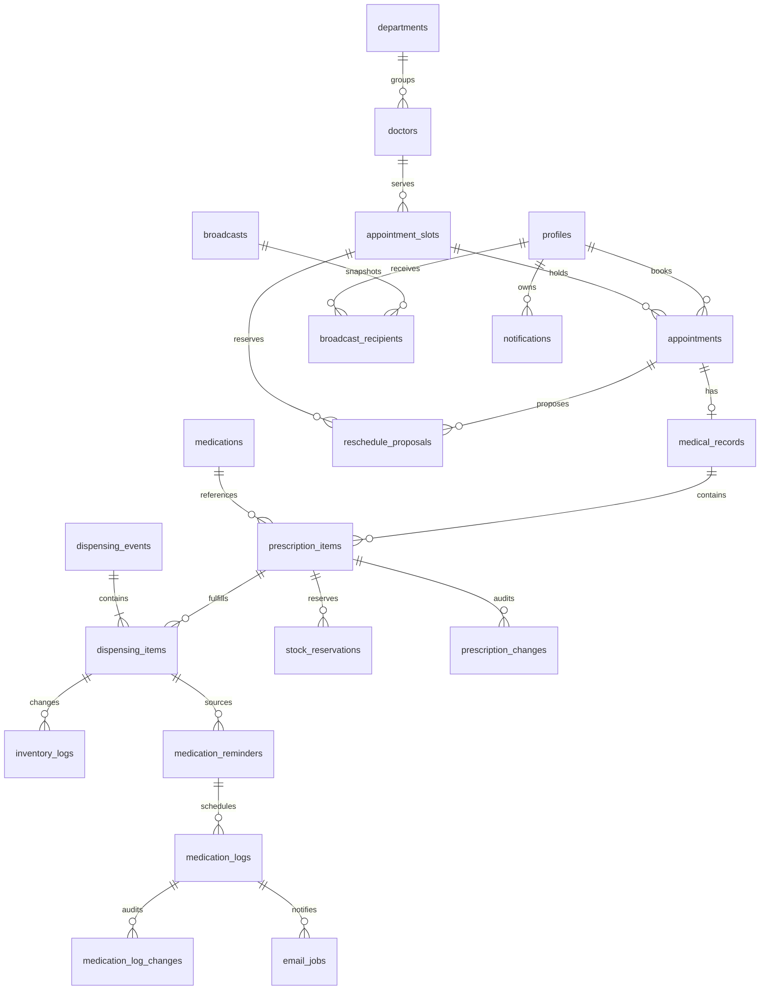

# 03. แบบข้อมูลและ ER

ปรับปรุง 5 กันยายน 2569 (2026-09-05) — ข้อกำหนดสำหรับพัฒนา ยังไม่ใช่หลักฐานว่าโค้ดหรือฐานข้อมูลทำครบแล้ว

## สถานะ

ฐานเดิมในเอกสารมี 11 ตารางและรายการยา JSONB ใน medical_records แบบด้านล่างเป็น **ข้อเสนอเชิงแนวคิดเพื่อรองรับข้อสรุปใหม่** ชื่อตาราง/ฟิลด์/สถานะยังต้องรับรองก่อนเขียน migration ไม่ได้อนุมัติแบบแยกตารางจากการอนุมัติกติกาธุรกิจ และยังไม่มีการแก้ SQL จริง

## ข้อมูลฐานเดิมและส่วนที่ต้องปรับ

| Entity | ข้อมูลหลัก/ความสัมพันธ์ | ผลจากข้อสรุป |
| --- | --- | --- |
| profiles | id → auth.users; full_name, phone, role, student_id, allergies, chronic_diseases | เพิ่มประเภทผู้ป่วย รหัสบุคลากร หน่วยงาน มี/ไม่มี/ไม่ทราบ และสถานะบัญชี/รุ่นสิทธิ์; จำกัดข้อมูลอ่านตามบทบาท |
| departments | id, name, description | คง 4 แผนกตาม Catalog; ปิดใช้งานโดยรักษาประวัติ |
| doctors | id → profiles, department_id → departments, specialty | สังกัดหนึ่งแผนกตามฐานเดิม |
| appointment_slots | doctor_id, slot_date, start_time, end_time, max_capacity, booked_count, status | available/full/closed; วันไทย ไม่มีข้ามวัน; คิดความจุรวมที่กันไว้ |
| appointments | user_id → profiles, slot_id, queue_number, reason, status | pending/confirmed/in_progress/completed/cancelled/no_show/rejected; ต้องเชื่อมประวัติข้อเสนอเลื่อนนัด |
| medical_records | appointment_id, patient_id, doctor_id, diagnosis, treatment, prescribed_medications | หนึ่งนัดต่อผลตรวจ; JSONB เดิมไม่พออธิบายประวัติแบ่งจ่ายด้วยสถานะทั้งใบเพียงค่าเดียว |
| medications | id, name, type, category, stock, min_stock, expiry_date, is_active | แยกยอดคงคลังกับยอดพร้อมจ่ายหลังหักการกัน |
| inventory_logs | medication_id, quantity_change, transaction_type, performed_by, timestamp | ผูกการจ่ายจริงแต่ละครั้งและเหตุผล ไม่ลงการกันเป็นการจ่าย |
| medication_reminders | user_id, medication_id, times, start/end | ผูกยาที่จ่ายจริง ผู้สร้าง Staff ผู้ยืนยันและเวลายืนยัน; ล็อกหลังยืนยัน |
| medication_logs | reminder_id, scheduled_time, actual_time, status | pending/taken/missed; เส้นตายบันทึกและประวัติแก้ ไม่ใช้ skipped แทน missed |
| notifications | user_id, type, title, message, is_read, created_at | เจ้าของกล่องเท่านั้น; ผูกเหตุการณ์เพื่อกันซ้ำและแยกประวัติ Broadcast กลาง |

ชื่อฟิลด์ในตารางนี้อธิบายหน้าที่ ไม่ใช่ TypeScript contract ที่ตรวจตรงกับโค้ดแล้ว ก่อนพัฒนาต้องเทียบ migration จริงและตรึงชื่อเดียวกัน

## ER ที่เสนอสำหรับข้อมูลธุรกรรมเพิ่ม

## Data Dictionary ส่วนที่เสนอเพิ่ม

| Entity เสนอ | ข้อมูลที่ต้องเก็บ |
| --- | --- |
| reschedule_proposals | appointment, old/new slot, ผู้เสนอ, sent_at, response_deadline = sent_at + 24h, ผลตอบ/ยืนยันอัตโนมัติ, เวลาสิ้นสุดการกัน, version |
| prescription_items | medical_record, medication, จำนวนสั่ง/หน่วย/คำสั่งใช้, version; จำนวนจ่ายแล้ว ค้าง ยกเลิกค้างคำนวณจากประวัติ |
| dispensing_events / dispensing_items | รหัสการจ่ายแต่ละครั้ง ผู้จ่าย เวลา รายการยา จำนวนจริง เหตุผลแบ่งจ่าย และ idempotency key |
| stock_reservations | รายการยา จำนวนกัน ผู้ยืนยันพร้อมจ่าย เวลา สถานะกัน/ใช้/ปล่อยและเหตุผล |
| prescription_changes | รายการ/เวอร์ชัน ก่อน–หลัง เหตุผล ผู้แก้ เวลา ไม่แก้ทับส่วนที่จ่ายแล้ว |
| medication_log_changes | มื้อ ก่อน–หลัง actual_time ผู้แก้ เวลา เหตุผล/ชนิดการแก้ |
| email_jobs | เหตุการณ์/มื้อ ผู้รับ scheduled_at ชนิดปกติ/ซ้ำ/เจ้าหน้าที่ สถานะ attempt ผู้ให้บริการและข้อผิดพลาด |
| broadcasts / broadcast_recipients | ผู้ส่ง เนื้อหา request key; รายชื่อผู้รับตรึงด้วย broadcast_id + user_id และสถานะกล่องของผู้รับ |

ข้อมูลพักอีเมลต้องมี pause_until; การส่งโดย Staff ต้องบันทึกผู้ส่ง เหตุผล และข้อจำกัด 1 ครั้งต่อมื้อทั้งระบบ จะเก็บในตารางใดให้รับรองพร้อมแบบสุดท้าย

## Invariants ที่แบบสุดท้ายต้องรองรับ

- 0 ≤ จำนวนจอง/กันที่ ≤ ความจุ; การกดซ้ำไม่เพิ่มหรือลดความจุซ้ำ รอบ closed ไม่เปิดเองเมื่อคืนที่
- จำนวนค้าง = จำนวนสั่ง − จ่ายแล้ว − ยกเลิกค้าง โดยทุกส่วนไม่ติดลบ การแก้ใบสั่งสร้างประวัติ/เวอร์ชันและคงการจ่ายเดิม
- ยอดพร้อมจ่าย = stock − จำนวนกันที่ยังมีผล; การจ่าย การกันและการปล่อยทำภายในธุรกรรม ตรวจ version และสิทธิ์ซ้ำ
- ห้ามจ่ายเกินค้างหรือใช้ยาที่กันให้คนอื่น; การกดคำขอเดิมซ้ำไม่ตัดสต๊อกซ้ำ แต่การรับยาค้างครั้งใหม่ทำได้
- หนึ่งมื้อต่อรายการเตือนและเวลาที่กำหนด; หนึ่งผู้รับต่อ Broadcast; งานส่งแต่ละชนิดต้องมีรหัสกันซ้ำ
- แยกผลวินิจฉัยจากข้อมูลจ่ายยาให้ Staff/Pharmacist อ่านเฉพาะช่องที่อนุญาต RLS รายแถวอย่างเดียวไม่จำกัดคอลัมน์ในแถว
- ข้อมูลเวลาเหตุการณ์ใช้ timestamp ที่ระบุเขตเวลา ส่วนแสดงวัน/เส้นตายใช้ Asia/Bangkok

## แผน migration ภายหลัง

สำรวจฐานจริงและข้อมูล JSON เดิม → รับรอง mapping/ER/contracts → เพิ่ม migration ที่แปลงข้อมูลเดิมโดยรักษา ID และประวัติ → เติมสิทธิ์/ธุรกรรม → สร้าง types → ทดสอบทั้งติดตั้งใหม่และอัปเกรดฐานเดิม ไม่แก้ migration ที่ใช้งานไปแล้วโดยไม่มีแผนร่วม ดู [09](09_implementation_plan.md)
