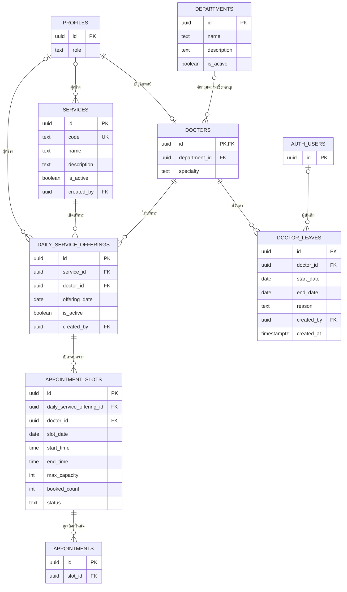

# ER — Scheduling ของสุพจน์

เรียบเรียง 23 กันยายน 2569 จาก schema migrations และการใช้งานตารางที่พบใน code ปัจจุบัน

## ขอบเขต

แบบจำลองนี้เก็บเฉพาะข้อมูลแผนก แพทย์ บริการ วันลา ตาราง และ slot ในขอบเขต owner สุพจน์ บัญชี `profiles` เป็น shared data; `appointments` อยู่ใน owner view ของปายและแสดงที่นี่เฉพาะจุดเชื่อม slot

## ER

`profiles.id` and `doctors.id` share the same key: a profile can have zero or one doctor record, and each doctor record belongs to one profile. A doctor may belong to zero or one department, while a department may have many doctors. `daily_service_offerings` links one service and one doctor for a specific `offering_date`; an offering can have multiple slots, and the composite foreign key requires each slot's `doctor_id` and `slot_date` to match the offering. Each doctor may have many leave records, and each leave belongs to one doctor. A slot may be linked to multiple appointments, up to its `max_capacity`.

`PROFILES` และ `APPOINTMENTS` เป็น shared/external entities; `AUTH_USERS` แสดงเฉพาะ FK ผู้บันทึกวันลา. ความสัมพันธ์จาก slot ไป appointment เป็น handoff ไป flow นัดหมายของปาย

## คำอธิบายแต่ละ Entity

| Entity | หน้าที่ในแบบจำลอง |
| --- | --- |
| `PROFILES` | เก็บข้อมูลบัญชีและ role ของผู้ใช้ เป็น shared entity ที่แพทย์และข้อมูลผู้สร้างอ้างอิง |
| `AUTH_USERS` | บัญชีผู้ใช้ของ Supabase Auth; ใน ER นี้แสดงเฉพาะความสัมพันธ์ผู้บันทึกวันลา |
| `DEPARTMENTS` | จัดกลุ่มแพทย์ตามแผนกหรือความเชี่ยวชาญ ใช้จัดประเภทแพทย์ ไม่ใช่รายการบริการที่จองได้ |
| `DOCTORS` | ข้อมูลแพทย์ผู้ให้บริการ เชื่อมกับ `PROFILES` ด้วย ID เดียวกัน และอาจสังกัดแผนก |
| `SERVICES` | รายการบริการของคลินิกที่ผู้ป่วยใช้เลือกประกอบการจอง มี `code` สำหรับระบุบริการ |
| `DAILY_SERVICE_OFFERINGS` | ระบุว่าบริการใดเปิดโดยแพทย์คนใดในวันใด เป็น entity กลางที่เชื่อม `SERVICES`, `DOCTORS` และ `APPOINTMENT_SLOTS` |
| `APPOINTMENT_SLOTS` | รอบตรวจที่จองได้ในวันและเวลาที่กำหนด เก็บความจุ จำนวนที่จองแล้ว และสถานะของรอบ |
| `DOCTOR_LEAVES` | ช่วงวันลาที่บันทึกให้แพทย์ ใช้กันการสร้าง slot ใหม่ในช่วงนั้น และไม่ยกเลิก slot หรือนัดเดิมอัตโนมัติ |
| `APPOINTMENTS` | รายการนัดของผู้ป่วยที่อ้างถึง slot; เป็นข้อมูลใน owner view ของปายและแสดงใน ER นี้เพื่อบอกจุดเชื่อมกับตารางตรวจ |

## ความสัมพันธ์ระหว่าง Entity

| Entity relationship | Cardinality | ข้อกำหนดใน schema/code |
| --- | --- | --- |
| `profiles.id` → `doctors.id` | โปรไฟล์หนึ่งรายการเชื่อมกับแพทย์ได้ 0 หรือ 1 คน; แพทย์แต่ละคนต้องมีโปรไฟล์ 1 รายการ | `doctors.id` เป็น PK และ FK ไปยัง `profiles.id` |
| `departments.id` → `doctors.department_id` | แผนกหนึ่งมีแพทย์ได้หลายคน; แพทย์แต่ละคนสังกัดได้ 0 หรือ 1 แผนก | `department_id` เว้นว่างได้ |
| `profiles.id` → `services.created_by` | โปรไฟล์หนึ่งรายการสร้างบริการได้หลายรายการ; บริการแต่ละรายการมีผู้สร้าง 0 หรือ 1 บัญชี | `created_by` เป็น FK ที่เว้นว่างได้ |
| `profiles.id` → `daily_service_offerings.created_by` | โปรไฟล์หนึ่งรายการสร้าง offering ได้หลายรายการ; offering แต่ละรายการมีผู้สร้าง 0 หรือ 1 บัญชี | `created_by` เป็น FK ที่เว้นว่างได้ |
| `services.id` → `daily_service_offerings.service_id` | บริการหนึ่งรายการมี offering ได้หลายรายการ; offering แต่ละรายการอ้างบริการ 1 รายการ | unique ต่อ `(service_id, doctor_id, offering_date)` |
| `doctors.id` → `daily_service_offerings.doctor_id` | แพทย์หนึ่งคนมี offering ได้หลายรายการ; offering แต่ละรายการอ้างแพทย์ 1 คน | unique key `(id, doctor_id, offering_date)` รองรับ FK แบบประกอบของ slot |
| `daily_service_offerings` → `appointment_slots` | offering หนึ่งรายการมี slot ได้หลายรายการ; slot แต่ละรายการอ้าง offering 1 รายการ | FK `(daily_service_offering_id, doctor_id, slot_date)` อ้าง `(id, doctor_id, offering_date)` จึงบังคับแพทย์และวันที่ให้ตรงกัน |
| `doctors.id` → `doctor_leaves.doctor_id` | แพทย์หนึ่งคนมีวันลาได้หลายรายการ; วันลาแต่ละรายการเป็นของแพทย์ 1 คน | `start_date <= end_date`; exclusion constraint กันช่วงลาซ้อน; ลบแพทย์แล้วลบวันลาที่อ้างถึง |
| `auth.users.id` → `doctor_leaves.created_by` | ผู้ใช้ Auth หนึ่งบัญชีบันทึกวันลาได้หลายรายการ; วันลาแต่ละรายการมีผู้บันทึก 0 หรือ 1 บัญชี | `created_by` เป็น FK ที่เว้นว่างได้ |
| `appointment_slots.id` → `appointments.slot_id` | slot หนึ่งรายการเชื่อมกับนัดหมายได้หลายรายการ; นัดหมายแต่ละรายการอ้าง slot 1 รายการ | `slot_id` เป็น FK ที่ต้องมีค่า; `max_capacity` ระบุจำนวนรับของ slot; การจองอยู่ใน owner ของปาย |

## ข้อมูลที่ยังไม่ยืนยัน

รายละเอียดนี้อิง migrations และ code ใน repository จึงยังไม่ยืนยันว่า schema หรือ policy ถูก apply ใน Supabase เป้าหมายแล้ว ต้องตรวจ migration history, constraints และ session-based RLS บนฐานเป้าหมายแยกต่างหาก รายละเอียดวันเวลา ความจุ สิทธิ์ และผลจากวันลาดู [User Stories](user-stories.md) และ [Use Cases](use-cases.md)

## แหล่งอ้างอิง

- `supabase/migrations/01_schema.sql` — `departments`, `doctors`, `appointment_slots`, `appointments`
- `supabase/migrations/13_services_and_daily_offerings.sql` — services, offerings และ composite FK
- `supabase/migrations/23_doctor_leaves.sql` — วันลาและข้อจำกัดช่วงวันที่
- `supabase/migrations/24_batch_create_slots.sql` — operation สร้าง slot หลายรายการ
- `src/features/scheduling/data/apiRepository.ts` และ `src/app/api/` — API data paths
- [ER กลาง](../../03_database_design_and_er.md) — แผนที่ข้อมูลส่วนระบบอื่น
