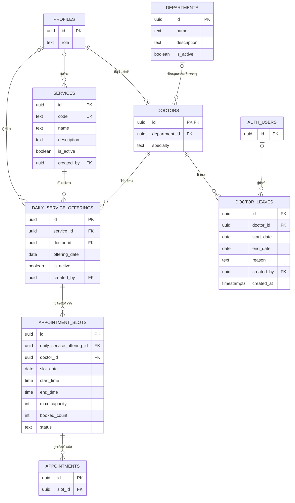

# ER — Scheduling ของสุพจน์

เรียบเรียง 23 กันยายน 2569 จาก schema migrations และการใช้งานตารางที่พบใน code ปัจจุบัน

## ขอบเขต

แบบจำลองนี้เก็บเฉพาะข้อมูลแผนก แพทย์ บริการ วันลา ตาราง และ slot ในขอบเขต owner สุพจน์ บัญชี `profiles` เป็น shared data; `appointments` อยู่ใน owner view ของปายและแสดงที่นี่เฉพาะจุดเชื่อม slot

## ER

`PROFILES` และ `APPOINTMENTS` เป็น shared/external entities; `AUTH_USERS` แสดงเฉพาะ FK ผู้บันทึกวันลา. ความสัมพันธ์จาก slot ไป appointment เป็น handoff ไป flow นัดหมายของปาย

## Key และกติกาความสัมพันธ์

| ความสัมพันธ์ | ข้อกำหนดใน schema/code |
| --- | --- |
| `profiles.id` → `doctors.id` | `doctors.id` เป็น PK และ FK ไปยังบัญชี profile เดียวกัน |
| `profiles.id` → `services.created_by` และ `daily_service_offerings.created_by` | ผู้สร้างอาจอ้างบัญชี profile หนึ่งบัญชี |
| `auth.users.id` → `doctor_leaves.created_by` | ผู้บันทึกวันลาอาจอ้างบัญชี Auth หนึ่งบัญชี |
| `departments.id` → `doctors.department_id` | แพทย์มีแผนกได้ไม่เกินหนึ่งรายการ; `department_id` เว้นว่างได้ |
| `services` → `daily_service_offerings` | offering หนึ่งรายการอ้างบริการเดียว; unique ต่อ `(service_id, doctor_id, offering_date)` |
| `doctors` → `daily_service_offerings` | offering หนึ่งรายการอ้างแพทย์เดียว; มี unique key `(id, doctor_id, offering_date)` รองรับ FK แบบประกอบของ slot |
| `daily_service_offerings` → `appointment_slots` | FK `(daily_service_offering_id, doctor_id, slot_date)` อ้าง `(id, doctor_id, offering_date)` จึงบังคับแพทย์และวันที่ให้ตรงกับ offering |
| `doctors` → `doctor_leaves` | `start_date <= end_date`; exclusion constraint กันช่วงลาซ้อนของแพทย์คนเดียวกัน; การลบแพทย์ลบวันลาที่อ้างถึง |
| `appointment_slots` → `appointments` | `appointments.slot_id` อ้าง `appointment_slots.id`; การจองและจัดการนัดอยู่ใน owner ของปาย |

## ข้อมูลที่ยังไม่ยืนยัน

รายละเอียดนี้อิง migrations และ code ใน repository จึงยังไม่ยืนยันว่า schema หรือ policy ถูก apply ใน Supabase เป้าหมายแล้ว ต้องตรวจ migration history, constraints และ session-based RLS บนฐานเป้าหมายแยกต่างหาก รายละเอียดวันเวลา ความจุ สิทธิ์ และผลจากวันลาดู [User Stories](user-stories.md) และ [Use Cases](use-cases.md)

## แหล่งอ้างอิง

- `supabase/migrations/01_schema.sql` — `departments`, `doctors`, `appointment_slots`, `appointments`
- `supabase/migrations/13_services_and_daily_offerings.sql` — services, offerings และ composite FK
- `supabase/migrations/23_doctor_leaves.sql` — วันลาและข้อจำกัดช่วงวันที่
- `supabase/migrations/24_batch_create_slots.sql` — operation สร้าง slot หลายรายการ
- `src/features/scheduling/data/apiRepository.ts` และ `src/app/api/` — API data paths
- [ER กลาง](../../03_database_design_and_er.md) — แผนที่ข้อมูลส่วนระบบอื่น