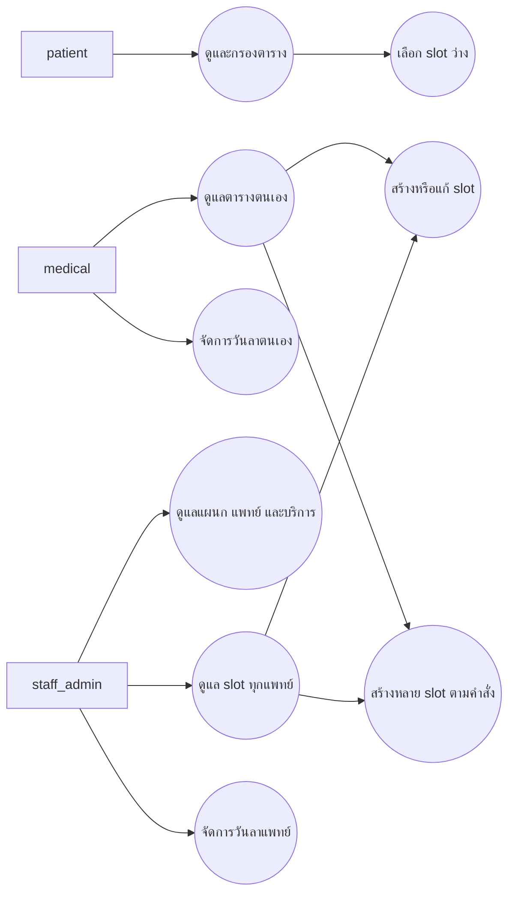

# Use Cases — Scheduling ของสุพจน์

เรียบเรียง 23 กันยายน 2569 จาก route, component, API repository และ domain rule ใน code ปัจจุบัน

## Actors

- ผู้ป่วย (`patient`) — ดูตารางและส่ง slot ที่เลือกไปเริ่มจองนัด
- แพทย์ (`medical`) — ดูตาราง จัดการบริการ/slot ของตน และจัดการวันลาของตน
- เจ้าหน้าที่/แอดมิน (`staff_admin`) — ดูแลแผนก แพทย์ บริการ ตาราง และวันลาทั้งคลินิก

## ภาพรวม

## รายละเอียด Use Case

### UC-SUP-01 ดูตารางและเลือก slot

**ผู้แสดงหลัก:** `patient`
**เงื่อนไขก่อนเริ่ม:** เปิดหน้า `/schedules`; การจองต่อทำใน flow นัดหมาย

1. ระบบโหลดบริการ แพทย์ และ slot จาก API
2. ผู้ป่วยกรองตารางตามวันที่ แพทย์ หรือบริการ
3. ระบบแสดงสถานะ `available`, `full` หรือ `closed`
4. ผู้ป่วยเลือก slot ที่ `available`; หน้าเว็บส่ง `slotId` ไป `/appointments`

**กรณีทางเลือก:** slot เต็มหรือปิดยังแสดงสถานะ แต่ไม่มี action เริ่มจองจาก slot นั้น

### UC-SUP-02 จัดการแผนกและข้อมูลแพทย์

**ผู้แสดงหลัก:** `staff_admin`
**เงื่อนไขก่อนเริ่ม:** session ผ่าน API role check

1. เจ้าหน้าที่เปิดหน้าจัดการแผนกหรือแพทย์
2. เพิ่มหรือแก้ข้อมูลแผนก แพทย์ หรือการผูกบัญชีแพทย์
3. เปลี่ยนสถานะเปิดใช้งานเมื่อจำเป็น
4. API ตรวจบัญชีแพทย์และบันทึกข้อมูล

**กรณีผิดพลาด:** API ปฏิเสธบัญชีที่ไม่มี role `medical` หรือไม่ได้เปิดใช้งาน

### UC-SUP-03 ดูแล catalog บริการ

**ผู้แสดงหลัก:** `medical`, `staff_admin`
**เงื่อนไขก่อนเริ่ม:** session ผ่าน API role check

1. เจ้าหน้าที่เปิดแท็บบริการที่ `/departments`; แพทย์เปิด flow เพิ่มบริการจาก `ScheduleWorkspace`
2. เจ้าหน้าที่เพิ่มหรือแก้ code, ชื่อ และรายละเอียดบริการ หรือเปลี่ยนสถานะ; แพทย์เพิ่มบริการจากหน้าตารางตรวจ
3. ระบบอ่านรายการผ่าน `GET /api/services` และบันทึกผ่าน `POST /api/services` หรือ `PATCH /api/services/{id}`

**ผลต่อข้อมูล:** daily offering ระบุบริการ แพทย์ และวันที่; การสร้าง slot ผูก slot กับ offering

### UC-SUP-04 สร้าง slot เดี่ยว

**ผู้แสดงหลัก:** `medical` สร้างให้ตนเอง; `staff_admin` สร้างให้แพทย์คนใดก็ได้

1. ผู้ใช้เลือกแพทย์ บริการ วันที่ เวลา และความจุ
2. ระบบตรวจวันทำการ เวลาเปิดคลินิก ช่วงพัก เวลาปัจจุบันของวันนั้น จำนวนจอง ความซ้ำซ้อน วันลา และสิทธิ์; หากเป็นวันปัจจุบัน เวลาเริ่มต้องไม่น้อยกว่าเวลาปัจจุบันตาม `Asia/Bangkok`
3. UI แสดงผล validation; เมื่อผ่าน ผู้ใช้ยืนยันบันทึก
4. API สร้างหรือใช้ daily offering ของ service/doctor/date แล้วบันทึก slot

**กรณีผิดพลาด:** วันหยุดสุดสัปดาห์ วันย้อนหลัง เวลานอกช่วง เวลาที่ผ่านไปแล้วในวันปัจจุบัน เวลาทับซ้อน วันลา หรือข้อมูลไม่ถูกต้อง ทำให้ระบบปฏิเสธการบันทึก

### UC-SUP-05 สร้างหลาย slot ตามคำสั่ง

**ผู้แสดงหลัก:** `medical` สร้างให้ตนเอง; `staff_admin` สร้างให้แพทย์คนใดก็ได้

1. ผู้ใช้เลือกแพทย์ บริการ วันที่ และ time block
2. UI แสดง preview รายการที่จะบันทึกและรายการที่ข้าม
3. ผู้ใช้ยืนยัน; API เรียก batch operation
4. ระบบข้ามวันที่ลา slot ที่ขัดกัน และ time block ที่เริ่มไปแล้วของวันปัจจุบัน โดยยังใช้เวลาทำการปกติในวันอนาคต แล้วรายงานจำนวนที่สร้าง

**ขอบเขต:** ผู้ใช้เริ่มสร้างแต่ละครั้งผ่านปุ่มและยืนยัน preview; API บันทึก concrete slots ตามวันที่เลือก ไม่มี weekly/recurring schedule, template หรือการสร้างอัตโนมัติ; ขอบเขตนี้ยึด D25 ใน [User Stories](user-stories.md)

### UC-SUP-06 แก้ เปิด ปิด หรือลบ slot

**ผู้แสดงหลัก:** `medical` เฉพาะ slot ของตน; `staff_admin` ทุก slot

1. ผู้ใช้เลือก slot จากปฏิทินและเริ่มแก้ไขหรือเปลี่ยนสถานะ
2. ระบบตรวจสิทธิ์ วันที่เริ่ม จำนวนจอง และความจุ
3. ระบบขอการยืนยันสำหรับ action ที่ต้องยืนยัน แล้วบันทึกผ่าน API

**กติกา:** ลบรอบที่มีผู้จองแล้วไม่ได้; ความจุต้องไม่น้อยกว่าจำนวนจอง; รอบที่เริ่มแล้วแก้ไม่ได้; รอบปิดด้วยมือที่ยังไม่เริ่มแก้ได้และคงสถานะปิด

### UC-SUP-07 จัดการวันลาแพทย์

**ผู้แสดงหลัก:** `medical` จัดการตนเอง; `staff_admin` จัดการแพทย์ทุกคน

1. ผู้ใช้เลือกแพทย์และช่วงวันลาในปฏิทิน
2. ระบบตรวจว่าวันลาไม่อยู่ในอดีต ช่วงวันที่ถูกต้อง และไม่ซ้ำ แล้วแสดงจำนวน slot เดิมที่ทับช่วงลา
3. ผู้ใช้บันทึกหรือแก้วันลา; ระบบยืนยันก่อนยกเลิก
4. API บันทึกหรือยกเลิกข้อมูล `doctor_leaves`

**ผลกระทบ:** ระบบกัน slot ใหม่ในวันที่ลา; slot และนัดเดิมคงอยู่เพื่อให้ผู้รับผิดชอบประสานต่อด้วยมือ

## ขอบเขตหลักฐาน

Use case นี้สรุป behavior ใน repository ยังไม่ยืนยันผลบน Supabase เป้าหมาย, session-based RLS หรือ browser QA ดู [as-built](as-built.md) แยกตามชนิดหลักฐาน

## เอกสารที่เกี่ยวข้อง

- [User Stories](user-stories.md)
- [ER เฉพาะโมดูล](er.md)
- [ข้อสรุปทีม D25/D26/D28](../../10_team_decisions.md)
