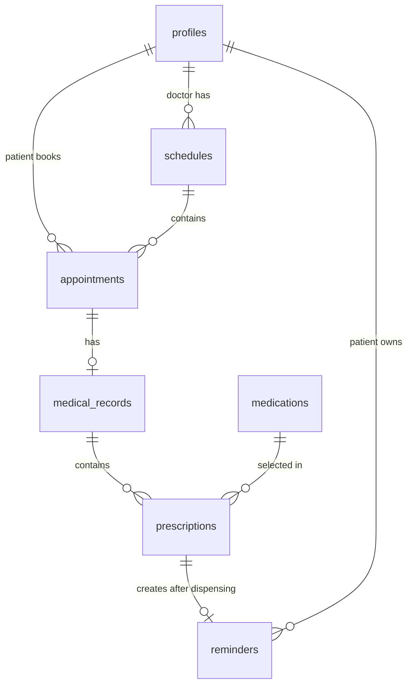

# 03. แบบข้อมูลและ ER ฉบับย่อ

ปรับปรุง 6 กันยายน 2569 (2026-09-06)

> สถานะ: แบบข้อมูล Supabase เชิงข้อเสนอ ยังไม่มีการสร้าง SQL, migration หรือเปลี่ยนฐานข้อมูลจริง

## หลักออกแบบ

- ใช้ Supabase Auth และ 7 ตารางธุรกิจเท่านั้น
- Doctor และ Staff เป็น role ใน `profiles`; ไม่มีตาราง Doctor หรือ Department แยก
- ใบสั่งยาหนึ่งใบมีหลาย `prescriptions`
- การจ่ายเก็บสถานะบน `prescriptions`; ไม่มี dispensing event หรือ inventory log
- การกดกินแล้วเก็บเฉพาะครั้งล่าสุดบน `reminders`; ไม่มี medication log รายมื้อ
- `profiles.id` อ้าง `auth.users.id`; password และ email verification ให้ Supabase Auth จัดการ
- Runtime อ่านและเขียน PostgreSQL ผ่าน Supabase repository
- ใช้ grants + RLS ทุกตาราง และใช้ PostgreSQL RPC เฉพาะการจ่ายยาทั้งชุด

`auth.users` เป็นตารางระบบที่ Supabase จัดการ จึงไม่นับรวม 7 Entity ธุรกิจ

## ER

## สรุป Entity

| Entity | หน้าที่ |
| --- | --- |
| `profiles` | ข้อมูลแอปและบทบาทของบัญชี Supabase Auth |
| `schedules` | รอบตรวจของ Doctor |
| `appointments` | การจองของ Patient |
| `medical_records` | ผลตรวจหนึ่งรายการต่อนัด |
| `medications` | Catalog ยาและ stock ปัจจุบัน |
| `prescriptions` | รายการยาที่สั่งและสถานะจ่าย |
| `reminders` | เวลาเตือนในเว็บและการกดกินล่าสุด |

## 1. Profile Entity (`profiles`)

| Attribute | Description | Key | Type | Unique | Not Null | Validation | Example |
| --- | --- | --- | --- | --- | --- | --- | --- |
| `id` | รหัสผู้ใช้ | PK, FK (`auth.users.id`) | UUID | Yes | Yes | ตรงกับบัญชี Supabase Auth | `11111111-1111-1111-1111-111111111111` |
| `full_name` | ชื่อ–นามสกุล | | TEXT(150) | | Yes | ไม่เป็นข้อความว่าง | `สมชาย ใจดี` |
| `phone` | เบอร์โทร | | TEXT(20) | | Yes | 9–10 หลัก | `0812345678` |
| `allergies` | ข้อมูลแพ้ยาแบบข้อความ | | TEXT | | | ว่างได้ | `Penicillin` |
| `role` | บทบาท | | TEXT(20) | | Yes | `patient`, `doctor`, `staff` | `patient` |
| `is_active` | เปิดใช้บัญชี | | BOOLEAN | | Yes | ค่าเริ่มต้น `true` | `true` |
| `created_at` | เวลาสร้าง | | TIMESTAMP | | Yes | สร้างอัตโนมัติ | `2026-09-06T08:00:00+07:00` |

## 2. Schedule Entity (`schedules`)

| Attribute | Description | Key | Type | Unique | Not Null | Validation | Example |
| --- | --- | --- | --- | --- | --- | --- | --- |
| `id` | รหัสรอบตรวจ | PK | UUID | Yes | Yes | สร้างโดยระบบ | `44444444-4444-4444-4444-444444444444` |
| `doctor_id` | Doctor เจ้าของรอบ | FK (`profiles.id`) | UUID | | Yes | profile ต้องเป็น `doctor` | `22222222-2222-2222-2222-222222222222` |
| `schedule_date` | วันที่ตรวจ | | DATE | | Yes | ต้องเป็นวันนี้หรืออนาคตเมื่อสร้าง | `2026-09-10` |
| `start_time` | เวลาเริ่ม | | TIME | | Yes | น้อยกว่า `end_time` | `09:00` |
| `end_time` | เวลาสิ้นสุด | | TIME | | Yes | มากกว่า `start_time` | `10:00` |
| `capacity` | จำนวนรับสูงสุด | | INTEGER | | Yes | มากกว่า 0 | `5` |
| `status` | สถานะรอบ | | TEXT(20) | | Yes | `open`, `closed` | `open` |
| `created_at` | เวลาสร้าง | | TIMESTAMP | | Yes | สร้างอัตโนมัติ | `2026-09-06T08:00:00+07:00` |

จำนวนจองคำนวณจาก `appointments` ที่เป็น `pending` หรือ `confirmed` ไม่เก็บ `booked_count` ซ้ำใน Entity นี้

## 3. Appointment Entity (`appointments`)

| Attribute | Description | Key | Type | Unique | Not Null | Validation | Example |
| --- | --- | --- | --- | --- | --- | --- | --- |
| `id` | รหัสนัด | PK | UUID | Yes | Yes | สร้างโดยระบบ | `55555555-5555-5555-5555-555555555555` |
| `patient_id` | Patient ผู้จอง | FK (`profiles.id`) | UUID | | Yes | profile ต้องเป็น `patient` | `11111111-1111-1111-1111-111111111111` |
| `schedule_id` | รอบที่จอง | FK (`schedules.id`) | UUID | | Yes | รอบเปิด อนาคต และไม่เต็ม | `44444444-4444-4444-4444-444444444444` |
| `reason` | อาการ/เหตุผล | | TEXT(500) | | Yes | ไม่เป็นข้อความว่าง | `มีไข้และเจ็บคอ` |
| `status` | สถานะนัด | | TEXT(20) | | Yes | `pending`, `confirmed`, `completed`, `cancelled` | `pending` |
| `created_at` | เวลาจอง | | TIMESTAMP | | Yes | สร้างอัตโนมัติ | `2026-09-06T09:00:00+07:00` |
| `updated_at` | เวลาแก้ล่าสุด | | TIMESTAMP | | Yes | ปรับอัตโนมัติ | `2026-09-06T09:05:00+07:00` |

คู่ `patient_id + schedule_id` ต้องไม่ซ้ำสำหรับนัดที่ยังไม่ cancelled

## 4. Medical Record Entity (`medical_records`)

| Attribute | Description | Key | Type | Unique | Not Null | Validation | Example |
| --- | --- | --- | --- | --- | --- | --- | --- |
| `id` | รหัสผลตรวจ | PK | UUID | Yes | Yes | สร้างโดยระบบ | `66666666-6666-6666-6666-666666666666` |
| `appointment_id` | นัดที่เกี่ยวข้อง | FK (`appointments.id`) | UUID | Yes | Yes | หนึ่งผลตรวจต่อนัด | `55555555-5555-5555-5555-555555555555` |
| `diagnosis` | ผลวินิจฉัย | | TEXT | | Yes | ไม่เป็นข้อความว่างก่อนปิด | `คออักเสบ` |
| `treatment` | คำแนะนำรักษา | | TEXT | | Yes | ไม่เป็นข้อความว่างก่อนปิด | `พักผ่อนและดื่มน้ำ` |
| `created_at` | เวลาสร้าง | | TIMESTAMP | | Yes | สร้างอัตโนมัติ | `2026-09-10T09:20:00+07:00` |
| `updated_at` | เวลาแก้ล่าสุด | | TIMESTAMP | | Yes | ปรับอัตโนมัติ | `2026-09-10T09:30:00+07:00` |

สถานะ draft/closed อ้างจาก `appointments.status`: Doctor แก้ผลได้เมื่อ appointment เป็น `confirmed`; เมื่อเปลี่ยน appointment เป็น `completed` ถือว่าปิดผลและล็อกการแก้

## 5. Medication Entity (`medications`)

| Attribute | Description | Key | Type | Unique | Not Null | Validation | Example |
| --- | --- | --- | --- | --- | --- | --- | --- |
| `id` | รหัสยา | PK | UUID | Yes | Yes | สร้างโดยระบบ | `77777777-7777-7777-7777-777777777777` |
| `name` | ชื่อยา | | TEXT(150) | Yes | Yes | ไม่เป็นข้อความว่าง | `Paracetamol 500 mg` |
| `unit` | หน่วยนับ | | TEXT(30) | | Yes | ไม่เป็นข้อความว่าง | `เม็ด` |
| `stock` | ยอดคงเหลือ | | INTEGER | | Yes | `stock >= 0` | `100` |
| `is_active` | ใช้สั่งยาได้ | | BOOLEAN | | Yes | ค่าเริ่มต้น `true` | `true` |
| `updated_at` | เวลาแก้ล่าสุด | | TIMESTAMP | | Yes | ปรับอัตโนมัติ | `2026-09-06T10:00:00+07:00` |

## 6. Prescription Entity (`prescriptions`)

| Attribute | Description | Key | Type | Unique | Not Null | Validation | Example |
| --- | --- | --- | --- | --- | --- | --- | --- |
| `id` | รหัสรายการสั่งยา | PK | UUID | Yes | Yes | สร้างโดยระบบ | `88888888-8888-8888-8888-888888888888` |
| `medical_record_id` | ผลตรวจต้นทาง | FK (`medical_records.id`) | UUID | | Yes | ผลตรวจต้องเป็นของ Doctor เจ้าของนัด | `66666666-6666-6666-6666-666666666666` |
| `medication_id` | ยาที่สั่ง | FK (`medications.id`) | UUID | | Yes | ยาต้อง active | `77777777-7777-7777-7777-777777777777` |
| `quantity` | จำนวนที่สั่งและจ่าย | | INTEGER | | Yes | จำนวนเต็มมากกว่า 0 | `10` |
| `instructions` | คำสั่งใช้ยา | | TEXT(300) | | Yes | ไม่เป็นข้อความว่าง | `ครั้งละ 1 เม็ด หลังอาหาร` |
| `status` | สถานะจ่าย | | TEXT(20) | | Yes | `pending`, `dispensed` | `pending` |
| `dispensed_by` | Staff ผู้จ่าย | FK (`profiles.id`) | UUID | | | ต้องเป็น `staff` เมื่อจ่ายแล้ว | `33333333-3333-3333-3333-333333333333` |
| `dispensed_at` | เวลาจ่าย | | TIMESTAMP | | | ต้องมีเมื่อสถานะ `dispensed` | `2026-09-10T10:00:00+07:00` |

## 7. Reminder Entity (`reminders`)

| Attribute | Description | Key | Type | Unique | Not Null | Validation | Example |
| --- | --- | --- | --- | --- | --- | --- | --- |
| `id` | รหัสเตือน | PK | UUID | Yes | Yes | สร้างโดยระบบ | `99999999-9999-9999-9999-999999999999` |
| `prescription_id` | ยาที่จ่ายแล้ว | FK (`prescriptions.id`) | UUID | Yes | Yes | prescription ต้อง `dispensed` | `88888888-8888-8888-8888-888888888888` |
| `patient_id` | เจ้าของเตือน | FK (`profiles.id`) | UUID | | Yes | ต้องเป็นเจ้าของนัดต้นทาง | `11111111-1111-1111-1111-111111111111` |
| `reminder_time` | เวลาเตือนรายวัน | | TIME | | Yes | รูปแบบ `HH:mm` | `08:00` |
| `is_active` | เปิดหรือปิดเตือน | | BOOLEAN | | Yes | ค่าเริ่มต้น `true` | `true` |
| `last_taken_at` | เวลากดกินล่าสุด | | TIMESTAMP | | | ว่างได้ | `2026-09-11T08:05:00+07:00` |
| `created_at` | เวลาสร้าง | | TIMESTAMP | | Yes | สร้างอัตโนมัติ | `2026-09-10T10:10:00+07:00` |

## Invariants ขั้นพื้นฐาน

- Entity ที่อ้างถึงกันต้องมีจริง
- role ต้องเป็นหนึ่งใน 3 ค่า
- รอบปิด เต็ม หรือผ่านมาแล้วรับนัดใหม่ไม่ได้
- จำนวน `pending + confirmed` ต่อรอบต้องไม่เกิน `capacity`
- ผลตรวจหนึ่งรายการต่อนัด Doctor แก้เฉพาะนัดของตน และแก้ได้เมื่อ appointment เป็น `confirmed`
- การจ่ายสำเร็จเมื่อ stock ของยาทุกรายการพอ; ถ้าไม่พอไม่เปลี่ยนรายการใด
- prescription ที่ `dispensed` ห้ามจ่ายซ้ำ
- reminder สร้างได้หนึ่งรายการต่อ prescription ที่จ่ายแล้วและเป็นของ Patient คนนั้น

## Constraints และ Index ที่เสนอ

- `profiles.role CHECK IN ('patient','doctor','staff')`
- `schedules.capacity > 0`, `start_time < end_time`
- unique/index ช่วยค้น `schedules(doctor_id, schedule_date)` และตรวจเวลาทับใน service
- partial unique ป้องกัน Patient มี appointment ที่ไม่ cancelled ซ้ำใน schedule เดียว
- unique `medical_records(appointment_id)`
- `medications.stock >= 0`
- `prescriptions.quantity > 0` และ status เป็น `pending|dispensed`
- unique `reminders(prescription_id)`
- index foreign key และคอลัมน์ที่ใช้ใน RLS ทุกจุด

## RLS Matrix ที่เสนอ

| ตาราง | Patient | Doctor | Staff |
| --- | --- | --- | --- |
| `profiles` | อ่าน/แก้ข้อมูลตน | อ่านตนและ Patient ในนัดตน | อ่าน profile ที่จำเป็นต่อการทำงาน |
| `schedules` | อ่านรอบ | อ่านรอบตน | อ่าน/สร้าง/แก้ |
| `appointments` | อ่าน/สร้าง/ยกเลิกของตน | อ่านนัดที่ผูก schedule ตน | อ่าน/ยืนยัน/ยกเลิก |
| `medical_records` | อ่านของตนเมื่อ appointment completed | อ่าน/เขียนของนัดตนเมื่อ confirmed | ไม่อ่าน diagnosis |
| `medications` | อ่านยาที่เกี่ยวกับใบสั่งตน | อ่านรายการ active | อ่าน/สร้าง/แก้ |
| `prescriptions` | อ่านของตนเมื่อผลปิด | อ่าน/เขียนของนัดตนก่อน completed | อ่าน pending และจ่ายผ่าน RPC |
| `reminders` | CRUD ของตน | ไม่มี | ไม่มี |

RLS ต้องอ้าง `auth.uid()` และ role จาก `profiles` ผ่าน `private.current_user_role()` แบบ `security definer set search_path = ''` พร้อม schema-qualified names เพื่อเลี่ยง policy recursion ห้ามเชื่อ role จาก client metadata เพียงอย่างเดียว

## RPC จ่ายยา

เสนอ RPC `dispense_prescriptions(p_medical_record_id uuid)` ทำงานดังนี้:

1. ตรวจผู้เรียกเป็น Staff
2. ตรวจ appointment เป็น `completed`
3. ล็อกแถว medication ที่เกี่ยวข้อง
4. รวม quantity ต่อ medication และตรวจ stock ทุกตัว
5. ถ้าตัวใดไม่พอ raise error โดยไม่เปลี่ยนข้อมูล
6. ถ้าพอ ลด stock และเปลี่ยน prescription ทุกตัวเป็น `dispensed` พร้อม `dispensed_by/dispensed_at`

RPC ใช้ `auth.uid()` เป็นผู้จ่าย ไม่รับ `dispensed_by` จาก browser ใช้ public `security invoker` wrapper เรียก private implementation ที่ตรวจ Staff ซ้ำ กำหนด `search_path = ''` และอ้างชื่อตารางแบบ schema-qualified ต้อง revoke execute จาก `public`/`anon` แล้ว grant เฉพาะ `authenticated`

## แผน Migration ที่เสนอ

เมื่อได้รับอนุมัติจึงค่อย:

1. สร้าง migration สำหรับ 7 ตาราง, constraints และ indexes
2. สร้าง trigger `on_auth_user_created` เพื่อ validate email/metadata และสร้าง `public.profiles` role patient; function ต้อง `security definer set search_path = ''`, revoke execute ที่ไม่จำเป็น และทดสอบ เพราะ trigger error ทำให้ signup ล้มเหลว
3. สร้าง helper role, RLS policies และ RPC จ่ายยา
4. สร้าง seed สังเคราะห์สำหรับ Doctor, Staff, Patient และยา
5. ทดสอบ fresh install และ RLS ด้วยฐาน local/test ก่อนใช้ project จริง

ห้ามรัน migration หรือ seed กับ Supabase project จริงจากข้อเสนอนี้

## สิ่งที่แบบนี้ไม่เก็บ

ไม่มี Department, Doctor profile แยก, วันลา, ประวัติการเลื่อนนัด, dispensing event, stock reservation, inventory log, audit change, medication log, notification, email job หรือ broadcast
